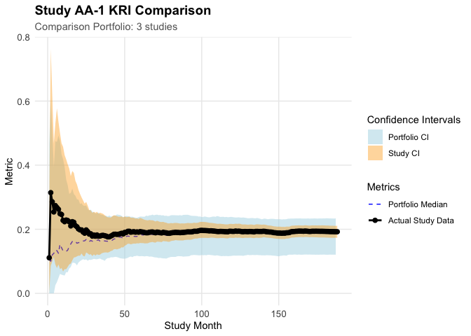

# gsm.studykri

<!-- badges: start -->
<!-- badges: end -->

## Overview

{gsm.studykri} provides a new approach for calculating KRI lower and
upper limits on study-level for quality monitoring in clinical trials.
The method uses bootstrapping to calculate confidence intervals for a
given study over-time. The confidence intervals can then be used to
compare the study-level KRI against a fixed expectation or against the
confidence intervals and KRI values over time of one or more reference
studies. The bootstrapping method resamples a new set of sites with
replacement from the original study data set.

## Installation

``` r
install.packages("pak")
pak::pak("Gilead-BioStats/clindata")
pak::pak("Gilead-BioStats/gsm.core")
pak::pak("Gilead-BioStats/gsm.mapping")
pak::pak("Gilead-BioStats/gsm.kri")
pak::pak("Gilead-BioStats/gsm.reporting")
pak::pak("IMPALA-Consortium/gsm.studykri")
```

## Example: Adverse Event Rate per Visit

This example demonstrates calculating a single KRI (AE per visit) using
the script-based approach without YAML workflows.

``` r
library(dplyr)
#> 
#> Attaching package: 'dplyr'
#> The following objects are masked from 'package:stats':
#> 
#>     filter, lag
#> The following objects are masked from 'package:base':
#> 
#>     intersect, setdiff, setequal, union
library(gsm.studykri)

# Simulate portfolio with 4 studies
lRaw <- list(
  Raw_SITE = clindata::ctms_site,
  Raw_STUDY = clindata::ctms_study,
  Raw_AE = clindata::rawplus_ae,
  Raw_SUBJ = clindata::rawplus_dm,
  Raw_VISIT = clindata::rawplus_visdt
)

# Add required subject identifier columns for resampling
lRaw$Raw_SUBJ$subjectname <- lRaw$Raw_SUBJ$subject_nsv
lRaw$Raw_SUBJ$subjectenrollmentnumber <- lRaw$Raw_SUBJ$subjectid

lPortfolio <- SimulatePortfolio(
  lRaw = lRaw,
  nStudies = 4,
  vSubjectIDs = c("subjid", "subjectenrollmentnumber", "subject_nsv", "subjectname", "subjectid"),
  dfConfig = tibble(
    studyid = c("AA-1", "AA-2", "AA-3", "AA-4"),
    nSubjects = c(500, 750, 150, 200),
    strOversamplDomain = rep("Raw_AE", 4),
    vOversamplQuantileRange_min = c(0, 0, 0, 0),
    vOversamplQuantileRange_max = c(1, 1, 1, 0.75)
  )
)

# Calculate site-level counts by month for AE per visit
dfInput <- Input_CountSiteByMonth(
  dfSubjects = lPortfolio$Raw_SUBJ,
  dfNumerator = lPortfolio$Raw_AE,
  dfDenominator = lPortfolio$Raw_VISIT |>
    mutate(visit_dt = as.Date(visit_dt)),
  strStudyCol = "studyid",
  strGroupCol = "invid",
  strGroupLevel = "Site",
  strSubjectCol = "subjid",
  strNumeratorDateCol = "aest_dt",
  strDenominatorDateCol = "visit_dt",
  nMinDenominator = 25  # Normalize dates at the threshold
)

# Aggregate to study-level cumulative counts
dfTransformed <- Transform_CumCount(
  dfInput,
  vBy = c("StudyID")
)

# Calculate 95% confidence bounds using bootstrap
dfBounds <- dfInput |>
  Analyze_StudyKRI_PredictBounds()
#> Using all 4 studies found in dfInput

# Calculate reference bounds from AA-2, AA-3, AA-4
dfStudyRef <- tibble(
  study = "AA-1",
  studyref = c("AA-2", "AA-3", "AA-4")
)

dfBoundsRef <- Analyze_StudyKRI_PredictBoundsRef(dfInput, dfStudyRef)
#> Resampling with minimum group count: 76

# Plot AA-1 vs reference portfolio
Visualize_StudyKRI(
  dfStudyKRI = dfTransformed,
  dfBounds = dfBounds,
  dfBoundsRef = dfBoundsRef,
  strStudyID = "AA-1"
)
```



## Implemented KRIs

The package includes 14 pre-configured KRI workflows:

| ID      | Abbreviation | Metric                                       | Numerator                         | Denominator         |
|---------|--------------|----------------------------------------------|-----------------------------------|---------------------|
| kri0001 | AE           | Adverse Event Rate per Days on Study         | Adverse Events                    | Days on Study       |
| kri0002 | SAE          | Serious Adverse Event Rate per Days on Study | Serious Adverse Events            | Days on Study       |
| kri0003 | PD           | Non-Important Protocol Deviation Rate        | Non-Important Protocol Deviations | Days on Study       |
| kri0004 | IPD          | Important Protocol Deviation Rate            | Important Protocol Deviations     | Days on Study       |
| kri0005 | LB           | Grade 3+ Lab Abnormality Rate                | Grade 3+ Abnormal Labs Samples    | Total Lab Samples   |
| kri0006 | SDSC         | Study Discontinuation Rate                   | Subjects Discontinued - Study     | Enrolled Subjects   |
| kri0007 | TDSC         | Treatment Discontinuation Rate               | Subjects Discontinued - Treatment | Enrolled Subjects   |
| kri0008 | QRY          | Query Rate                                   | Queries                           | Total Data Points   |
| kri0009 | OQRY         | Delayed Query Resolution Rate                | Queries That Were Open \> 30 Days | Total Queries       |
| kri0010 | ODAT         | Delayed Data Entry Rate                      | Data Pages Entered \> 10 Days     | Total Data Pages    |
| kri0011 | CDAT         | Data Change Rate                             | Data Points with 1+ Change        | Total Data Points   |
| kri0012 | SF           | Screen Failure Rate                          | Screen Failures                   | Screened Subjects   |
| kri0013 | PK           | PK Collection Compliance Rate                | PK Samples Collected              | PK Samples Expected |
| kri0014 | IE           | Inclusion/Exclusion Violation Rate           | Number of subjects ineligible     | Enrolled Subjects   |

All KRIs use bootstrap-based confidence intervals at site level with a
default of 1000 bootstrap replicates and 95% confidence level.

## AI Disclaimer

This package and documentation were developed with assistance from AI
tools, including Cursor and Claude Sonnet 4.5. All AI-generated content
has been reviewed.

## License

MIT © 2025 IMPALA Consortium

## Sample Report

- [Sample Report
  1](https://impala-consortium.github.io/gsm.studykri/report_studykri_AA-1.html)
- [Sample Report 2 (under-reporting
  study)](https://impala-consortium.github.io/gsm.studykri/report_studykri_AA-2.html)

## Quality Control

This project was developed until MVP
a2d4e9d8d588e87c3708168261505ac3da52a912

Since {gsm} is designed for use in a
[GCP](https://en.wikipedia.org/wiki/Good_clinical_practice) framework,
we have since extensive quality control as part of our development
process. In particular, we do the following during early development:

- **Unit Tests** - Unit tests are written for all core functions, 100%
  coverage required.
- **Workflow Tests** - Additional unit tests confirm that core workflows
  behave as expected.
- **Function Documentation** - Detailed documentation for each exported
  function with examples is maintained with Roxygen.
- **Package Checks** - Standard package checks are run using GitHub
  Actions and must be passing before PRs are merged.
- **Continuous Integration** - Continuous integration is provided via
  GitHub Actions.
- **Code Formatting** - Code is formatted with {styler} before each
  release.
- **Contributor Guidelines** - Detailed contributor guidelines including
  step-by-step processes for code development and releases are provided
  as a vignette.
- **Code Demonstration** -
  [Cookbook](https://impala-consortium.github.io/gsm.studykri/articles/Cookbook.html)
  Vignette provides demos and explanations for code usage.

### Parking

As development progresses, we will also conduct the following quality
control steps:

- **Qualification Workflow** - All assessments have been Qualified as
  described in the Qualification Workflow Vignette. A Qualification
  Report Vignette is generated and attached to each release.
- **Code Review** - Code review is conducted using GitHub Pull Requests
  (PRs), and a log of all PRs is included in the Qualification Report
  Vignette.
- **Data Specifications** - Machine-readable data specifications are
  maintained for all KRIs. Specifications are automatically added to
  relevant function documentation.
- **Regression Testing** - Extensive QC and testing is done before each
  release.
