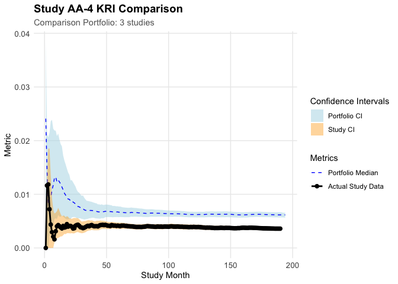

# gsm.studykri

<!-- badges: start -->
<!-- badges: end -->

## Overview

{gsm.studykri} provides a new approach for calculating KRI lower and
upper limits on study-level for quality monitoring in clinical trials.
The method uses bootstrapping to calculate confidence intervals for a
given study over-time. The confidence intervals can then be used to
compare the study-level KRI against a fixed expectation or against the
confidence intervals and KRI values over time of one or more reference
studies. The bootstrapping method resamples a new set of sites with
replacement from the original study data set.

## Installation

``` r
install.packages("pak")
pak::pak("Gilead-BioStats/clindata")
pak::pak("Gilead-BioStats/gsm.core")
pak::pak("Gilead-BioStats/gsm.mapping")
pak::pak("Gilead-BioStats/gsm.kri")
pak::pak("Gilead-BioStats/gsm.reporting")
pak::pak("IMPALA-Consortium/gsm.studykri")
```

## Example: Days on Study

``` r
library(dplyr)
#> 
#> Attaching package: 'dplyr'
#> The following objects are masked from 'package:stats':
#> 
#>     filter, lag
#> The following objects are masked from 'package:base':
#> 
#>     intersect, setdiff, setequal, union
library(gsm.core)
library(gsm.kri)
library(gsm.studykri)

# Load raw data from clindata package
lRaw <- list(
  Raw_AE = clindata::rawplus_ae,
  Raw_SUBJ = clindata::rawplus_dm
)

# Simulate portfolio with 4 studies, AA-4 oversampled for low AE counts
lPortfolio <- SimulatePortfolio(
  lRaw = lRaw,
  nStudies = 4,
  dfConfig = tibble(
    studyid = c("AA-1", "AA-2", "AA-3", "AA-4"),
    nSubjects = c(500, 750, 150, 200),
    strOversamplDomain = rep("Raw_AE", 4),
    vOversamplQuantileRange_min = c(0, 0, 0, 0),
    vOversamplQuantileRange_max = c(1, 1, 1, 0.75)
  )
)
#> Filtered to 1016 subjects with Raw_AE records in 0.00-1.00 quantile range (1-31 records)
#> Filtered to 1016 subjects with Raw_AE records in 0.00-1.00 quantile range (1-31 records)
#> Filtered to 1016 subjects with Raw_AE records in 0.00-1.00 quantile range (1-31 records)
#> Filtered to 773 subjects with Raw_AE records in 0.00-0.75 quantile range (1-6 records)

# Calculate site-level counts by month using days on study as denominator
# Pass subjects as denominator with start and end dates to calculate person-days
dfInputDays <- Input_CountSiteByMonth(
  dfSubjects = lPortfolio$Raw_SUBJ,
  dfNumerator = lPortfolio$Raw_AE,
  dfDenominator = lPortfolio$Raw_SUBJ,
  strStudyCol = "studyid",
  strGroupCol = "invid",
  strGroupLevel = "Site",
  strSubjectCol = "subjid",
  strNumeratorDateCol = "aest_dt",
  strDenominatorDateCol = "firstparticipantdate",
  strDenominatorEndDateCol = "lastparticipantdate"
) %>% tibble()

# Aggregate to study-level cumulative KRI by month
dfTransformed <- Transform_CumCount(
  dfInputDays,
  nMinDenominator = 25,
  vBy = c("StudyID")
) %>% tibble()

# Generate bootstrap resamples at site-level (1000 iterations)
df_Analyzed_Bootstrap_Site <- dfInputDays %>%
  Analyze_StudyKRI(nBootstrapReps = 1000) %>%
  tibble()

# Aggregate each bootstrap iteration to study-level
df_Analyzed_Bootstrap_Study <- df_Analyzed_Bootstrap_Site %>%
  Transform_CumCount(
    nMinDenominator = 25,
    vBy = c("StudyID", "BootstrapRep")
  ) %>% tibble()

# Calculate 95% confidence intervals from bootstrap distribution
df_Bounds <- Analyze_StudyKRI_PredictBounds(
  df_Analyzed_Bootstrap_Study,
  vBy = c("StudyID"),
  nConfLevel = 0.95
) %>% tibble()

# Calculate reference portfolio bounds from studies AA-1, AA-2, AA-3
# Reference bounds equalize site counts across studies for fair comparison
df_Bounds_Ref <- dfInputDays %>%
  Analyze_StudyKRI_PredictBoundsRefSet(
    vStudyFilter = c("AA-1", "AA-2", "AA-3"),
    nBootstrapReps = 1000,
    nConfLevel = 0.95,
    nMinDenominator = 25
  ) %>% tibble()
#> Resampling with minimum group count: 71

# Plot AA-4 KRI vs reference portfolio confidence intervals
Visualize_StudyKRI(
  dfStudyKRI = dfTransformed,
  dfBoundsRef = df_Bounds_Ref,
  dfBounds = df_Bounds,
  strStudyID = "AA-4"
)
```



## AI Disclaimer

This package and documentation were developed with assistance from AI
tools, including Cursor and Claude Sonnet 4.5. All AI-generated content
has been reviewed.

## License

MIT © 2025 IMPALA Consortium
