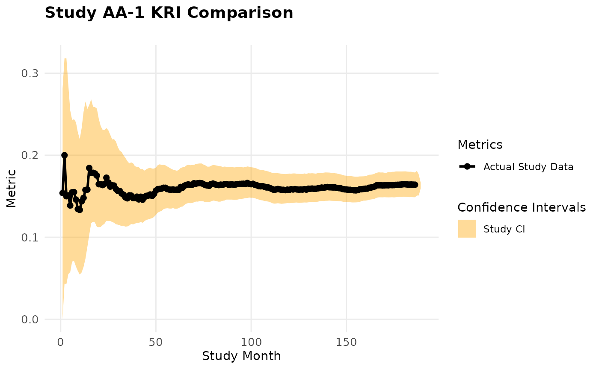
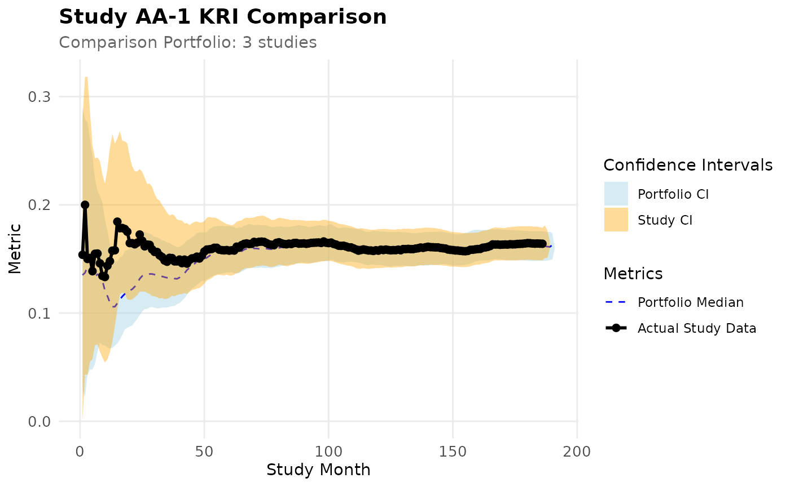
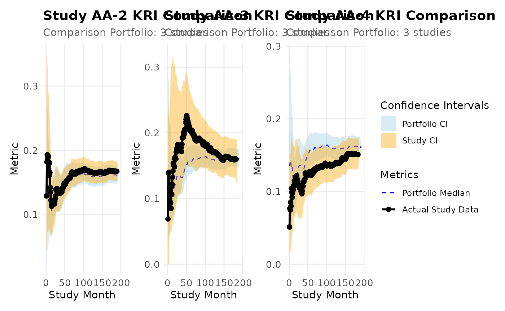

# Cookbook

## Installation

``` r
install.packages("pak")
pak::pak("Gilead-BioStats/clindata")
pak::pak("Gilead-BioStats/gsm.core")
pak::pak("Gilead-BioStats/gsm.mapping")
pak::pak("Gilead-BioStats/gsm.kri")
pak::pak("Gilead-BioStats/gsm.reporting")
pak::pak("IMPALA-Consortium/gsm.simaerep")
```

## Load

``` r
suppressPackageStartupMessages(library(dplyr))
library(gsm.core)
library(gsm.mapping)
library(gsm.kri)
library(gsm.reporting)
library(gsm.studykri)
#> 
#> Attaching package: 'gsm.studykri'
#> The following object is masked from 'package:gsm.reporting':
#> 
#>     BindResults
```

## Introduction

{gsm.studykir} presents an new approach for calculating KRI lower and
upper limits on study-level for quality monitoring in clincial trials.
The method uses bootstrapping to calculate confidence intervals gor a
given study over-time. The confidence intervals can then be used to
compare the study-level KRI against a fixed expectation or against the
confidence intervalls and KRI values over time of one or more reference
studies. The bootstrapping method resamples a new set of sites with
replacement from the original study data set.

## Simulate Data Set

We use the clindata package which includes data from one clinical study
to simulate new study data. We create a portfolio with study AA-4
oversampling patients with low AE counts.

``` r
lRaw <- list(
  Raw_SITE = clindata::ctms_site,
  Raw_STUDY = clindata::ctms_study,
  Raw_PD = clindata::ctms_protdev,
  Raw_DATAENT = clindata::edc_data_pages,
  Raw_QUERY = clindata::edc_queries,
  Raw_AE = clindata::rawplus_ae,
  Raw_SUBJ = clindata::rawplus_dm,
  Raw_ENROLL = clindata::rawplus_enroll,
  Raw_Randomization = clindata::rawplus_ixrsrand,
  Raw_LB = clindata::rawplus_lb,
  Raw_SDRGCOMP = clindata::rawplus_sdrgcomp,
  Raw_STUDCOMP = clindata::rawplus_studcomp,
  Raw_VISIT = clindata::rawplus_visdt
)

lPortfolio <- SimulatePortfolio(
  lRaw = lRaw,
  nStudies = 4,
  dfConfig = tibble(
    studyid = c("AA-1", "AA-2", "AA-3", "AA-4"),
    nSubjects = c(500, 750, 150, 200),
    strOversamplDomain = rep("Raw_AE", 4),
    vOversamplQuantileRange_min = c(0, 0, 0, 0),
    vOversamplQuantileRange_max = c(1, 1, 1, 0.75)
  )
)
```

## Calculate KRI

We will calculate the KRI “AE per visit”. For this we need to create
three dataframes:

- dfSubjects: Subject-level data that links subjects and sites from the
  demographics domain
- dfNumerator: Subject-level data that contains the events to be counted
  (AEs in this case)
- dfDenominator: Subject-level data that contains the denominator events
  (visits in this case

that we transform to return the site-level count of numerator and
denominator per month

``` r
dfInput <- gsm.studykri::Input_CountSiteByMonth(
  dfSubjects = lPortfolio$Raw_SUBJ,
  dfNumerator = lPortfolio$Raw_AE,
  dfDenominator = lPortfolio$Raw_VISIT,
  strStudyCol = "studyid",
  strGroupCol = "invid",
  strGroupLevel = "Site",
  strSubjectCol = "subjid",
  strNumeratorDateCol = "aest_dt",
  strDenominatorDateCol = "visit_dt",
)

dfInput
#> # A tibble: 19,901 × 7
#>    GroupID    GroupLevel Numerator Denominator Metric StudyID MonthYYYYMM
#>    <chr>      <chr>          <int>       <int>  <dbl> <chr>         <dbl>
#>  1 AA-1_0X001 Site               1           1    1   AA-1         201610
#>  2 AA-1_0X001 Site               1           1    1   AA-1         201611
#>  3 AA-1_0X001 Site               1           1    1   AA-1         201803
#>  4 AA-1_0X001 Site               1           0   NA   AA-1         201806
#>  5 AA-1_0X003 Site               3           1    3   AA-1         200410
#>  6 AA-1_0X003 Site               2           1    2   AA-1         200504
#>  7 AA-1_0X003 Site               1           0   NA   AA-1         200506
#>  8 AA-1_0X003 Site               1           1    1   AA-1         200602
#>  9 AA-1_0X003 Site               1           2    0.5 AA-1         200605
#> 10 AA-1_0X003 Site               1           1    1   AA-1         200907
#> # ℹ 19,891 more rows
```

Alternatively we can also use days on study as a denominator by passing
subjects as denominator and an end date.

``` r
dfInputDays <- gsm.studykri::Input_CountSiteByMonth(
  dfSubjects = lPortfolio$Raw_SUBJ,
  dfNumerator = lPortfolio$Raw_AE,
  dfDenominator = lPortfolio$Raw_SUBJ,
  strStudyCol = "studyid",
  strGroupCol = "invid",
  strGroupLevel = "Site",
  strSubjectCol = "subjid",
  strNumeratorDateCol = "aest_dt",
  strDenominatorDateCol = "firstparticipantdate",
  strDenominatorEndDateCol = "lastparticipantdate"
)

dfInputDays
#> # A tibble: 24,486 × 7
#>    GroupID    GroupLevel Numerator Denominator Metric StudyID MonthYYYYMM
#>    <chr>      <chr>          <int>       <int>  <dbl> <chr>         <dbl>
#>  1 AA-1_0X001 Site               1          31 0.0323 AA-1         201610
#>  2 AA-1_0X001 Site               1          30 0.0333 AA-1         201611
#>  3 AA-1_0X001 Site               1          31 0.0323 AA-1         201803
#>  4 AA-1_0X001 Site               1          30 0.0333 AA-1         201806
#>  5 AA-1_0X003 Site               3          31 0.0968 AA-1         200410
#>  6 AA-1_0X003 Site               2          30 0.0667 AA-1         200504
#>  7 AA-1_0X003 Site               1          30 0.0333 AA-1         200506
#>  8 AA-1_0X003 Site               1          56 0.0179 AA-1         200602
#>  9 AA-1_0X003 Site               1          62 0.0161 AA-1         200605
#> 10 AA-1_0X003 Site               1          31 0.0323 AA-1         200907
#> # ℹ 24,476 more rows
```

Next we transform the data to return the cumulated event counts on
study-level by study month. We define the first study month to be the
month in which we have reached the first 25 Denominator counts across
all sites to account for data artifacts.

``` r
dfTransformed <- gsm.studykri::Transform_CumCount(
  dfInput,
  nMinDenominator = 25,
  vBy = c("StudyID")
)

dfTransformed
#> # A tibble: 740 × 7
#>    StudyID MonthYYYYMM StudyMonth Numerator Denominator Metric GroupCount
#>    <chr>         <dbl>      <int>     <int>       <int>  <dbl>      <int>
#>  1 AA-1         200404          1         6          39  0.154         13
#>  2 AA-1         200405          2        12          60  0.2           16
#>  3 AA-1         200406          3        12          80  0.15          16
#>  4 AA-1         200407          4        16         106  0.151         18
#>  5 AA-1         200408          5        19         137  0.139         22
#>  6 AA-1         200409          6        26         168  0.155         23
#>  7 AA-1         200410          7        31         200  0.155         24
#>  8 AA-1         200411          8        34         233  0.146         24
#>  9 AA-1         200412          9        36         268  0.134         22
#> 10 AA-1         200501         10        40         300  0.133         23
#> # ℹ 730 more rows
```

Analyze_StudyKRI_PredictBounds calculates upper and lower confidence
intervalls of the study metrics KRI using a bootstrap technique.

``` r
dfBounds <- dfInput %>%
  gsm.studykri::Analyze_StudyKRI_PredictBounds()
#> Using all 4 studies found in dfInput

dfBounds
#> # A tibble: 752 × 6
#>    StudyID StudyMonth Median  Lower Upper BootstrapCount
#>    <chr>        <int>  <dbl>  <dbl> <dbl>          <int>
#>  1 AA-1             1  0.111 0      0.281           1000
#>  2 AA-1             2  0.162 0.0435 0.318           1000
#>  3 AA-1             3  0.159 0.0428 0.318           1000
#>  4 AA-1             4  0.143 0.0550 0.286           1000
#>  5 AA-1             5  0.142 0.0575 0.255           1000
#>  6 AA-1             6  0.146 0.0703 0.243           1000
#>  7 AA-1             7  0.152 0.0710 0.244           1000
#>  8 AA-1             8  0.146 0.0644 0.240           1000
#>  9 AA-1             9  0.138 0.0588 0.228           1000
#> 10 AA-1            10  0.133 0.0544 0.220           1000
#> # ℹ 742 more rows
```

We can plot the preliminary results.

``` r
gsm.studykri::Visualize_StudyKRI(
  dfStudyKRI = dfTransformed ,
  dfBounds = dfBounds,
  strStudyID = "AA-1"
)
```



We then calculate a reference confidence interval based on a set of
reference studies.

``` r

dfStudyRef <- tibble(
  study = "AA-1",
  studyref = c("AA-2", "AA-3", "AA-4")
)

dfBoundsRef <- gsm.studykri::Analyze_StudyKRI_PredictBoundsRef(dfInput, dfStudyRef)
#> Resampling with minimum group count: 78

dfBoundsRef
#> # A tibble: 191 × 9
#>    StudyMonth Median  Lower Upper BootstrapCount GroupCount StudyCount StudyID
#>         <int>  <dbl>  <dbl> <dbl>          <int>      <int>      <int> <chr>  
#>  1          1  0.135 0.0286 0.289           1000         78          3 AA-1   
#>  2          2  0.137 0.0227 0.279           1000         78          3 AA-1   
#>  3          3  0.143 0.0428 0.276           1000         78          3 AA-1   
#>  4          4  0.143 0.0476 0.260           1000         78          3 AA-1   
#>  5          5  0.137 0.048  0.245           1000         78          3 AA-1   
#>  6          6  0.133 0.0530 0.224           1000         78          3 AA-1   
#>  7          7  0.136 0.0642 0.213           1000         78          3 AA-1   
#>  8          8  0.134 0.0728 0.208           1000         78          3 AA-1   
#>  9          9  0.130 0.0703 0.202           1000         78          3 AA-1   
#> 10         10  0.121 0.0701 0.186           1000         78          3 AA-1   
#> # ℹ 181 more rows
#> # ℹ 1 more variable: StudyRefID <chr>
```

And add the reference confidence interval to out plot

``` r
gsm.studykri::Visualize_StudyKRI(
  dfStudyKRI = dfTransformed ,
  dfBounds = dfBounds,
  dfBoundsRef = dfBoundsRef,
  strStudyID = "AA-1"
)
```



We can also plot the members of the reference portfolio.

``` r
p1 <- gsm.studykri::Visualize_StudyKRI(
  dfStudyKRI = dfTransformed ,
  dfBounds = dfBounds,
  dfBoundsRef = dfBoundsRef,
  strStudyID = "AA-2"
)

p2 <- gsm.studykri::Visualize_StudyKRI(
  dfStudyKRI = dfTransformed ,
  dfBounds = dfBounds,
  dfBoundsRef = dfBoundsRef,
  strStudyID = "AA-3"
)

p3 <- gsm.studykri::Visualize_StudyKRI(
  dfStudyKRI = dfTransformed ,
  dfBounds = dfBounds,
  dfBoundsRef = dfBoundsRef,
  strStudyID = "AA-4"
)

library(patchwork)

p1 + p2 + p3 + patchwork::plot_layout(guides = "collect")
```



## Calculate KRI using yaml workflows

We can also use the {gsm}-style yaml workflow. Here we start with a
portfolio with 6 studies of which 2 are target studies for whcih reports
will be built, while the others serve as reference.

``` r
# Generate multi-study portfolio using SimulatePortfolio
lRaw_original <- list(
  Raw_SUBJ = clindata::rawplus_dm,
  Raw_AE = clindata::rawplus_ae,
  Raw_VISIT = clindata::rawplus_visdt,
  Raw_SITE = clindata::ctms_site,
  Raw_STUDY = clindata::ctms_study,
  Raw_PD = clindata::ctms_protdev,
  Raw_DATAENT = clindata::edc_data_pages,
  Raw_QUERY = clindata::edc_queries,
  Raw_ENROLL = clindata::rawplus_enroll,
  Raw_Randomization = clindata::rawplus_ixrsrand,
  Raw_LB = clindata::rawplus_lb,
  Raw_SDRGCOMP = clindata::rawplus_sdrgcomp,
  Raw_STUDCOMP = clindata::rawplus_studcomp
)

# Create a portfolio with 3 studies
lRaw <- SimulatePortfolio(
  lRaw = lRaw_original,
  nStudies = 3,
  seed = 123,
  dfConfig = tibble(
    studyid = c("AA-1", "AA-2", "AA-3", "AA-4", "AA-5", "AA-6"),
    nSubjects = c(500, 750, 150, 200, 250, 300),
    strOversamplDomain = rep("Raw_AE", 6),
    vOversamplQuantileRange_min = c(0, 0, 0, 0, 0, 0),
    vOversamplQuantileRange_max = c(1, 0.75, 1, 1, 0.95, 0.9)
  )
)

lRaw$Raw_StudyRef <- tibble(
  studyid = c(rep("AA-1", 3), rep("AA-2", 4)),
  studyrefid = c("AA-3", "AA-4", "AA-5", "AA-3", "AA-4", "AA-5", "AA-6")
)

# Run mapping workflows
mapping_wf <- gsm.core::MakeWorkflowList(
  strNames = NULL,
  strPath = system.file("workflow/1_mappings", package = "gsm.studykri"),
  strPackage = NULL
)

lIngest <- gsm.mapping::Ingest(lRaw, gsm.mapping::CombineSpecs(mapping_wf))
#> ℹ Ingesting data for AE.
#> Creating a new temporary DuckDB connection.
#> ✔ SQL Query complete: 6688 rows returned.
#> Disconnected from temporary DuckDB connection.
#> ℹ Ingesting data for ENROLL.
#> Creating a new temporary DuckDB connection.
#> ✔ SQL Query complete: 1819 rows returned.
#> Disconnected from temporary DuckDB connection.
#> ℹ Ingesting data for LB.
#> Creating a new temporary DuckDB connection.
#> ✔ SQL Query complete: 1585395 rows returned.
#> Disconnected from temporary DuckDB connection.
#> ℹ Ingesting data for PD.
#> Creating a new temporary DuckDB connection.
#> ✔ SQL Query complete: 0 rows returned.
#> Disconnected from temporary DuckDB connection.
#> ℹ Ingesting data for Randomization.
#> Creating a new temporary DuckDB connection.
#> ✔ SQL Query complete: 1819 rows returned.
#> Disconnected from temporary DuckDB connection.
#> ℹ Ingesting data for SDRGCOMP.
#> Creating a new temporary DuckDB connection.
#> ✔ SQL Query complete: 964 rows returned.
#> Disconnected from temporary DuckDB connection.
#> ℹ Ingesting data for STUDCOMP.
#> Creating a new temporary DuckDB connection.
#> ✔ SQL Query complete: 193 rows returned.
#> Disconnected from temporary DuckDB connection.
#> ℹ Ingesting data for StudyRef.
#> Creating a new temporary DuckDB connection.
#> ✔ SQL Query complete: 7 rows returned.
#> Disconnected from temporary DuckDB connection.
#> ℹ Ingesting data for SUBJ.
#> Creating a new temporary DuckDB connection.
#> ✔ SQL Query complete: 1819 rows returned.
#> Disconnected from temporary DuckDB connection.
#> ℹ Ingesting data for VISIT.
#> Creating a new temporary DuckDB connection.
#> Warning: Field `visit_dt`: 27 unparsable Date(s) set to NA
#> ✔ SQL Query complete: 39431 rows returned.
#> Disconnected from temporary DuckDB connection.
#> ℹ Ingesting data for DATAENT.
#> Creating a new temporary DuckDB connection.
#> ✔ SQL Query complete: 1484772 rows returned.
#> Disconnected from temporary DuckDB connection.
#> ℹ Ingesting data for SUBJ.
#> Creating a new temporary DuckDB connection.
#> ✔ SQL Query complete: 1819 rows returned.
#> Disconnected from temporary DuckDB connection.
#> ℹ Ingesting data for QUERY.
#> Creating a new temporary DuckDB connection.
#> ✔ SQL Query complete: 253554 rows returned.
#> Disconnected from temporary DuckDB connection.
#> ℹ Ingesting data for SITE.
#> Creating a new temporary DuckDB connection.
#> ✔ SQL Query complete: 636 rows returned.
#> Disconnected from temporary DuckDB connection.
#> ℹ Ingesting data for STUDY.
#> Creating a new temporary DuckDB connection.
#> ✔ SQL Query complete: 6 rows returned.
#> Disconnected from temporary DuckDB connection.


lMapped <- gsm.core::RunWorkflows(lWorkflows = mapping_wf, lData = lIngest)
#> 
#> ── Running 15 Workflows ────────────────────────────────────────────────────────
#> 
#> ── Initializing `Mapped_AE` Workflow ───────────────────────────────────────────
#> 
#> ── Checking data against spec
#> → All 1 data.frame(s) in the spec are present in the data: Raw_AE
#> → All specified columns in Raw_AE are in the expected format
#> → All 7 specified column(s) in the spec are present in the data: Raw_AE$subjid, Raw_AE$aeser, Raw_AE$aest_dt, Raw_AE$aeen_dt, Raw_AE$mdrpt_nsv, Raw_AE$mdrsoc_nsv, Raw_AE$aetoxgr
#> 
#> ── Workflow Step 1 of 1: `=` ──
#> 
#> ── Evaluating 2 parameter(s) for `=`
#> ℹ lhs = Mapped_AE: No matching data found. Passing 'Mapped_AE' as a string.
#> ✔ rhs = Raw_AE: Passing lData$Raw_AE.
#> 
#> ── Calling `=`
#> 
#> ── 6688x7 data.frame saved as `lData$Mapped_AE`.
#> 
#> ── Returning results from final step: 6688x7 data.frame`. ──
#> 
#> ── Completed `Mapped_AE` Workflow ──────────────────────────────────────────────
#> 
#> ── Initializing `Mapped_ENROLL` Workflow ───────────────────────────────────────
#> 
#> ── Checking data against spec
#> → All 1 data.frame(s) in the spec are present in the data: Raw_ENROLL
#> → All specified columns in Raw_ENROLL are in the expected format
#> → All 6 specified column(s) in the spec are present in the data: Raw_ENROLL$studyid, Raw_ENROLL$invid, Raw_ENROLL$country, Raw_ENROLL$subjid, Raw_ENROLL$subjectid, Raw_ENROLL$enrollyn
#> 
#> ── Workflow Step 1 of 1: `=` ──
#> 
#> ── Evaluating 2 parameter(s) for `=`
#> ℹ lhs = Mapped_ENROLL: No matching data found. Passing 'Mapped_ENROLL' as a string.
#> ✔ rhs = Raw_ENROLL: Passing lData$Raw_ENROLL.
#> 
#> ── Calling `=`
#> 
#> ── 1819x6 data.frame saved as `lData$Mapped_ENROLL`.
#> 
#> ── Returning results from final step: 1819x6 data.frame`. ──
#> 
#> ── Completed `Mapped_ENROLL` Workflow ──────────────────────────────────────────
#> 
#> ── Initializing `Mapped_LB` Workflow ───────────────────────────────────────────
#> 
#> ── Checking data against spec
#> → All 1 data.frame(s) in the spec are present in the data: Raw_LB
#> → All specified columns in Raw_LB are in the expected format
#> → All 2 specified column(s) in the spec are present in the data: Raw_LB$subjid, Raw_LB$toxgrg_nsv
#> 
#> ── Workflow Step 1 of 1: `=` ──
#> 
#> ── Evaluating 2 parameter(s) for `=`
#> ℹ lhs = Mapped_LB: No matching data found. Passing 'Mapped_LB' as a string.
#> ✔ rhs = Raw_LB: Passing lData$Raw_LB.
#> 
#> ── Calling `=`
#> 
#> ── 1585395x2 data.frame saved as `lData$Mapped_LB`.
#> 
#> ── Returning results from final step: 1585395x2 data.frame`. ──
#> 
#> ── Completed `Mapped_LB` Workflow ──────────────────────────────────────────────
#> 
#> ── Initializing `Mapped_PD` Workflow ───────────────────────────────────────────
#> 
#> ── Checking data against spec
#> → All 1 data.frame(s) in the spec are present in the data: Raw_PD
#> → All specified columns in Raw_PD are in the expected format
#> → All 2 specified column(s) in the spec are present in the data: Raw_PD$subjid, Raw_PD$deemedimportant
#> 
#> ── Workflow Step 1 of 1: `=` ──
#> 
#> ── Evaluating 2 parameter(s) for `=`
#> ℹ lhs = Mapped_PD: No matching data found. Passing 'Mapped_PD' as a string.
#> ✔ rhs = Raw_PD: Passing lData$Raw_PD.
#> 
#> ── Calling `=`
#> 
#> ── 0x2 data.frame saved as `lData$Mapped_PD`.
#> 
#> ── Returning results from final step: 0x2 data.frame`. ──
#> 
#> ── Completed `Mapped_PD` Workflow ──────────────────────────────────────────────
#> 
#> ── Initializing `Mapped_Randomization` Workflow ────────────────────────────────
#> 
#> ── Checking data against spec
#> → All 1 data.frame(s) in the spec are present in the data: Raw_Randomization
#> → All specified columns in Raw_Randomization are in the expected format
#> → All 6 specified column(s) in the spec are present in the data: Raw_Randomization$studyid, Raw_Randomization$invid, Raw_Randomization$subjid, Raw_Randomization$rand_dt, Raw_Randomization$status, Raw_Randomization$country
#> 
#> ── Workflow Step 1 of 1: `gsm.core::RunQuery` ──
#> 
#> ── Evaluating 2 parameter(s) for `gsm.core::RunQuery`
#> ✔ df = Raw_Randomization: Passing lData$Raw_Randomization.
#> ℹ strQuery = SELECT  studyid, invid, subjid, rand_dt, status, country FROM df WHERE subjid IS NOT NULL AND (status != 'Screen Failed' OR status IS NULL): No matching data found. Passing 'SELECT  studyid, invid, subjid, rand_dt, status, country FROM df WHERE subjid IS NOT NULL AND (status != 'Screen Failed' OR status IS NULL)' as a string.
#> 
#> ── Calling `gsm.core::RunQuery`
#> Creating a new temporary DuckDB connection.
#> ✔ SQL Query complete: 1819 rows returned.
#> Disconnected from temporary DuckDB connection.
#> 
#> ── 1819x6 data.frame saved as `lData$Mapped_Randomization`.
#> 
#> ── Returning results from final step: 1819x6 data.frame`. ──
#> 
#> ── Completed `Mapped_Randomization` Workflow ───────────────────────────────────
#> 
#> ── Initializing `Mapped_SDRGCOMP` Workflow ─────────────────────────────────────
#> 
#> ── Checking data against spec
#> → All 1 data.frame(s) in the spec are present in the data: Raw_SDRGCOMP
#> → All specified columns in Raw_SDRGCOMP are in the expected format
#> → All 3 specified column(s) in the spec are present in the data: Raw_SDRGCOMP$subjid, Raw_SDRGCOMP$sdrgyn, Raw_SDRGCOMP$phase
#> 
#> ── Workflow Step 1 of 1: `=` ──
#> 
#> ── Evaluating 2 parameter(s) for `=`
#> ℹ lhs = Mapped_SDRGCOMP: No matching data found. Passing 'Mapped_SDRGCOMP' as a string.
#> ✔ rhs = Raw_SDRGCOMP: Passing lData$Raw_SDRGCOMP.
#> 
#> ── Calling `=`
#> 
#> ── 964x3 data.frame saved as `lData$Mapped_SDRGCOMP`.
#> 
#> ── Returning results from final step: 964x3 data.frame`. ──
#> 
#> ── Completed `Mapped_SDRGCOMP` Workflow ────────────────────────────────────────
#> 
#> ── Initializing `Mapped_STUDCOMP` Workflow ─────────────────────────────────────
#> 
#> ── Checking data against spec
#> → All 1 data.frame(s) in the spec are present in the data: Raw_STUDCOMP
#> → All specified columns in Raw_STUDCOMP are in the expected format
#> → All 3 specified column(s) in the spec are present in the data: Raw_STUDCOMP$subjid, Raw_STUDCOMP$compyn, Raw_STUDCOMP$compreas
#> 
#> ── Workflow Step 1 of 1: `=` ──
#> 
#> ── Evaluating 2 parameter(s) for `=`
#> ℹ lhs = Mapped_STUDCOMP: No matching data found. Passing 'Mapped_STUDCOMP' as a string.
#> ✔ rhs = Raw_STUDCOMP: Passing lData$Raw_STUDCOMP.
#> 
#> ── Calling `=`
#> 
#> ── 193x3 data.frame saved as `lData$Mapped_STUDCOMP`.
#> 
#> ── Returning results from final step: 193x3 data.frame`. ──
#> 
#> ── Completed `Mapped_STUDCOMP` Workflow ────────────────────────────────────────
#> 
#> ── Initializing `Mapped_StudyRef` Workflow ─────────────────────────────────────
#> 
#> ── Checking data against spec
#> → All 1 data.frame(s) in the spec are present in the data: Raw_StudyRef
#> → All specified columns in Raw_StudyRef are in the expected format
#> → All 2 specified column(s) in the spec are present in the data: Raw_StudyRef$studyid, Raw_StudyRef$studyrefid
#> 
#> ── Workflow Step 1 of 1: `gsm.core::RunQuery` ──
#> 
#> ── Evaluating 2 parameter(s) for `gsm.core::RunQuery`
#> ✔ df = Raw_StudyRef: Passing lData$Raw_StudyRef.
#> ℹ strQuery = SELECT studyid AS study, studyrefid AS studyref FROM df: No matching data found. Passing 'SELECT studyid AS study, studyrefid AS studyref FROM df' as a string.
#> 
#> ── Calling `gsm.core::RunQuery`
#> Creating a new temporary DuckDB connection.
#> ✔ SQL Query complete: 7 rows returned.
#> Disconnected from temporary DuckDB connection.
#> 
#> ── 7x2 data.frame saved as `lData$Mapped_StudyRef`.
#> 
#> ── Returning results from final step: 7x2 data.frame`. ──
#> 
#> ── Completed `Mapped_StudyRef` Workflow ────────────────────────────────────────
#> 
#> ── Initializing `Mapped_SUBJ` Workflow ─────────────────────────────────────────
#> 
#> ── Checking data against spec
#> → All 1 data.frame(s) in the spec are present in the data: Raw_SUBJ
#> → All specified columns in Raw_SUBJ are in the expected format
#> → All 14 specified column(s) in the spec are present in the data: Raw_SUBJ$studyid, Raw_SUBJ$invid, Raw_SUBJ$country, Raw_SUBJ$subjid, Raw_SUBJ$subject_nsv, Raw_SUBJ$enrollyn, Raw_SUBJ$timeonstudy, Raw_SUBJ$firstparticipantdate, Raw_SUBJ$lastparticipantdate, Raw_SUBJ$firstdosedate, Raw_SUBJ$timeontreatment, Raw_SUBJ$agerep, Raw_SUBJ$sex, Raw_SUBJ$race
#> 
#> ── Workflow Step 1 of 1: `gsm.core::RunQuery` ──
#> 
#> ── Evaluating 2 parameter(s) for `gsm.core::RunQuery`
#> ✔ df = Raw_SUBJ: Passing lData$Raw_SUBJ.
#> ℹ strQuery = SELECT * FROM df WHERE enrollyn == 'Y': No matching data found. Passing 'SELECT * FROM df WHERE enrollyn == 'Y'' as a string.
#> 
#> ── Calling `gsm.core::RunQuery`
#> Creating a new temporary DuckDB connection.
#> ✔ SQL Query complete: 1819 rows returned.
#> Disconnected from temporary DuckDB connection.
#> 
#> ── 1819x14 data.frame saved as `lData$Mapped_SUBJ`.
#> 
#> ── Returning results from final step: 1819x14 data.frame`. ──
#> 
#> ── Completed `Mapped_SUBJ` Workflow ────────────────────────────────────────────
#> 
#> ── Initializing `Mapped_Visit` Workflow ────────────────────────────────────────
#> 
#> ── Checking data against spec
#> → All 1 data.frame(s) in the spec are present in the data: Raw_VISIT
#> → All specified columns in Raw_VISIT are in the expected format
#> → All 4 specified column(s) in the spec are present in the data: Raw_VISIT$subjid, Raw_VISIT$visit_dt, Raw_VISIT$visit_folder, Raw_VISIT$invid
#> 
#> ── Workflow Step 1 of 1: `gsm.core::RunQuery` ──
#> 
#> ── Evaluating 2 parameter(s) for `gsm.core::RunQuery`
#> ✔ df = Raw_VISIT: Passing lData$Raw_VISIT.
#> ℹ strQuery = SELECT subjid, visit_dt, visit_folder, invid FROM df: No matching data found. Passing 'SELECT subjid, visit_dt, visit_folder, invid FROM df' as a string.
#> 
#> ── Calling `gsm.core::RunQuery`
#> Creating a new temporary DuckDB connection.
#> ✔ SQL Query complete: 39431 rows returned.
#> Disconnected from temporary DuckDB connection.
#> 
#> ── 39431x4 data.frame saved as `lData$Mapped_VISIT`.
#> 
#> ── Returning results from final step: 39431x4 data.frame`. ──
#> 
#> ── Completed `Mapped_Visit` Workflow ───────────────────────────────────────────
#> 
#> ── Initializing `Mapped_DATAENT` Workflow ──────────────────────────────────────
#> 
#> ── Checking data against spec
#> → All 2 data.frame(s) in the spec are present in the data: Raw_DATAENT, Mapped_SUBJ
#> → All specified columns in Raw_DATAENT are in the expected format
#> → All specified columns in Mapped_SUBJ are in the expected format
#> → All 4 specified column(s) in the spec are present in the data: Raw_DATAENT$subject_nsv, Raw_DATAENT$data_entry_lag, Mapped_SUBJ$subjid, Mapped_SUBJ$subject_nsv
#> 
#> ── Workflow Step 1 of 2: `dplyr::select` ──
#> 
#> ── Evaluating 3 parameter(s) for `dplyr::select`
#> ✔ .data = Mapped_SUBJ: Passing lData$Mapped_SUBJ.
#> ℹ subjid = subjid: No matching data found. Passing 'subjid' as a string.
#> ℹ subject_nsv = subject_nsv: No matching data found. Passing 'subject_nsv' as a string.
#> 
#> ── Calling `dplyr::select`
#> 
#> ── 1819x2 data.frame saved as `lData$Temp_SubjectLookup`.
#> 
#> ── Workflow Step 2 of 2: `dplyr::left_join` ──
#> 
#> ── Evaluating 3 parameter(s) for `dplyr::left_join`
#> ✔ x = Raw_DATAENT: Passing lData$Raw_DATAENT.
#> ✔ y = Temp_SubjectLookup: Passing lData$Temp_SubjectLookup.
#> ℹ by = subject_nsv: No matching data found. Passing 'subject_nsv' as a string.
#> 
#> ── Calling `dplyr::left_join`
#> 
#> ── 1484772x3 data.frame saved as `lData$Mapped_DATAENT`.
#> 
#> ── Returning results from final step: 1484772x3 data.frame`. ──
#> 
#> ── Completed `Mapped_DATAENT` Workflow ─────────────────────────────────────────
#> 
#> ── Initializing `Mapped_QUERY` Workflow ────────────────────────────────────────
#> 
#> ── Checking data against spec
#> → All 2 data.frame(s) in the spec are present in the data: Raw_QUERY, Mapped_SUBJ
#> → All specified columns in Raw_QUERY are in the expected format
#> → All specified columns in Mapped_SUBJ are in the expected format
#> → All 5 specified column(s) in the spec are present in the data: Raw_QUERY$subject_nsv, Raw_QUERY$querystatus, Raw_QUERY$queryage, Mapped_SUBJ$subjid, Mapped_SUBJ$subject_nsv
#> 
#> ── Workflow Step 1 of 2: `dplyr::select` ──
#> 
#> ── Evaluating 3 parameter(s) for `dplyr::select`
#> ✔ .data = Mapped_SUBJ: Passing lData$Mapped_SUBJ.
#> ℹ subjid = subjid: No matching data found. Passing 'subjid' as a string.
#> ℹ subject_nsv = subject_nsv: No matching data found. Passing 'subject_nsv' as a string.
#> 
#> ── Calling `dplyr::select`
#> 
#> ── 1819x2 data.frame saved as `lData$Temp_SubjectLookup`.
#> 
#> ── Workflow Step 2 of 2: `dplyr::left_join` ──
#> 
#> ── Evaluating 3 parameter(s) for `dplyr::left_join`
#> ✔ x = Raw_QUERY: Passing lData$Raw_QUERY.
#> ✔ y = Temp_SubjectLookup: Passing lData$Temp_SubjectLookup.
#> ℹ by = subject_nsv: No matching data found. Passing 'subject_nsv' as a string.
#> 
#> ── Calling `dplyr::left_join`
#> 
#> ── 253554x4 data.frame saved as `lData$Mapped_QUERY`.
#> 
#> ── Returning results from final step: 253554x4 data.frame`. ──
#> 
#> ── Completed `Mapped_QUERY` Workflow ───────────────────────────────────────────
#> 
#> ── Initializing `Mapped_COUNTRY` Workflow ──────────────────────────────────────
#> 
#> ── Checking data against spec
#> → All 1 data.frame(s) in the spec are present in the data: Mapped_SUBJ
#> → All specified columns in Mapped_SUBJ are in the expected format
#> → All 3 specified column(s) in the spec are present in the data: Mapped_SUBJ$country, Mapped_SUBJ$invid, Mapped_SUBJ$subjid
#> 
#> ── Workflow Step 1 of 2: `gsm.core::RunQuery` ──
#> 
#> ── Evaluating 2 parameter(s) for `gsm.core::RunQuery`
#> ✔ df = Mapped_SUBJ: Passing lData$Mapped_SUBJ.
#> ℹ strQuery = SELECT country as GroupID, COUNT(DISTINCT subjid) as ParticipantCount, COUNT(DISTINCT invid) as SiteCount FROM df GROUP BY country: No matching data found. Passing 'SELECT country as GroupID, COUNT(DISTINCT subjid) as ParticipantCount, COUNT(DISTINCT invid) as SiteCount FROM df GROUP BY country' as a string.
#> 
#> ── Calling `gsm.core::RunQuery`
#> Creating a new temporary DuckDB connection.
#> ✔ SQL Query complete: 3 rows returned.
#> Disconnected from temporary DuckDB connection.
#> 
#> ── 3x3 data.frame saved as `lData$Temp_CountryCountsWide`.
#> 
#> ── Workflow Step 2 of 2: `gsm.mapping::MakeLongMeta` ──
#> 
#> ── Evaluating 2 parameter(s) for `gsm.mapping::MakeLongMeta`
#> ✔ data = Temp_CountryCountsWide: Passing lData$Temp_CountryCountsWide.
#> ℹ strGroupLevel = Country: No matching data found. Passing 'Country' as a string.
#> 
#> ── Calling `gsm.mapping::MakeLongMeta`
#> 
#> ── 6x4 data.frame saved as `lData$Mapped_COUNTRY`.
#> 
#> ── Returning results from final step: 6x4 data.frame`. ──
#> 
#> ── Completed `Mapped_COUNTRY` Workflow ─────────────────────────────────────────
#> 
#> ── Initializing `Mapped_SITE` Workflow ─────────────────────────────────────────
#> 
#> ── Checking data against spec
#> → All 2 data.frame(s) in the spec are present in the data: Raw_SITE, Mapped_SUBJ
#> → All specified columns in Raw_SITE are in the expected format
#> → All specified columns in Mapped_SUBJ are in the expected format
#> → All 11 specified column(s) in the spec are present in the data: Raw_SITE$studyid, Raw_SITE$invid, Raw_SITE$InvestigatorFirstName, Raw_SITE$InvestigatorLastName, Raw_SITE$site_status, Raw_SITE$City, Raw_SITE$State, Raw_SITE$Country, Mapped_SUBJ$studyid, Mapped_SUBJ$invid, Mapped_SUBJ$subjid
#> 
#> ── Workflow Step 1 of 5: `gsm.core::RunQuery` ──
#> 
#> ── Evaluating 2 parameter(s) for `gsm.core::RunQuery`
#> ✔ df = Raw_SITE: Passing lData$Raw_SITE.
#> ℹ strQuery = SELECT invid as GroupID, * FROM df: No matching data found. Passing 'SELECT invid as GroupID, * FROM df' as a string.
#> 
#> ── Calling `gsm.core::RunQuery`
#> Creating a new temporary DuckDB connection.
#> ✔ SQL Query complete: 636 rows returned.
#> Disconnected from temporary DuckDB connection.
#> 
#> ── 636x9 data.frame saved as `lData$Temp_CTMSSiteWide`.
#> 
#> ── Workflow Step 2 of 5: `gsm.mapping::MakeLongMeta` ──
#> 
#> ── Evaluating 2 parameter(s) for `gsm.mapping::MakeLongMeta`
#> ✔ data = Temp_CTMSSiteWide: Passing lData$Temp_CTMSSiteWide.
#> ℹ strGroupLevel = Site: No matching data found. Passing 'Site' as a string.
#> 
#> ── Calling `gsm.mapping::MakeLongMeta`
#> 
#> ── 5088x4 data.frame saved as `lData$Temp_CTMSSite`.
#> 
#> ── Workflow Step 3 of 5: `gsm.core::RunQuery` ──
#> 
#> ── Evaluating 2 parameter(s) for `gsm.core::RunQuery`
#> ✔ df = Mapped_SUBJ: Passing lData$Mapped_SUBJ.
#> ℹ strQuery = SELECT invid as GroupID, COUNT(DISTINCT subjid) as ParticipantCount, COUNT(DISTINCT invid) as SiteCount FROM df GROUP BY invid: No matching data found. Passing 'SELECT invid as GroupID, COUNT(DISTINCT subjid) as ParticipantCount, COUNT(DISTINCT invid) as SiteCount FROM df GROUP BY invid' as a string.
#> 
#> ── Calling `gsm.core::RunQuery`
#> Creating a new temporary DuckDB connection.
#> ✔ SQL Query complete: 606 rows returned.
#> Disconnected from temporary DuckDB connection.
#> 
#> ── 606x3 data.frame saved as `lData$Temp_SiteCountsWide`.
#> 
#> ── Workflow Step 4 of 5: `gsm.mapping::MakeLongMeta` ──
#> 
#> ── Evaluating 2 parameter(s) for `gsm.mapping::MakeLongMeta`
#> ✔ data = Temp_SiteCountsWide: Passing lData$Temp_SiteCountsWide.
#> ℹ strGroupLevel = Site: No matching data found. Passing 'Site' as a string.
#> 
#> ── Calling `gsm.mapping::MakeLongMeta`
#> 
#> ── 1212x4 data.frame saved as `lData$Temp_SiteCounts`.
#> 
#> ── Workflow Step 5 of 5: `dplyr::bind_rows` ──
#> 
#> ── Evaluating 2 parameter(s) for `dplyr::bind_rows`
#> ✔ Temp_CTMSSite = Temp_CTMSSite: Passing lData$Temp_CTMSSite.
#> ✔ Temp_SiteCounts = Temp_SiteCounts: Passing lData$Temp_SiteCounts.
#> 
#> ── Calling `dplyr::bind_rows`
#> 
#> ── 6300x4 data.frame saved as `lData$Mapped_SITE`.
#> 
#> ── Returning results from final step: 6300x4 data.frame`. ──
#> 
#> ── Completed `Mapped_SITE` Workflow ────────────────────────────────────────────
#> 
#> ── Initializing `Mapped_STUDY` Workflow ────────────────────────────────────────
#> 
#> ── Checking data against spec
#> → All 2 data.frame(s) in the spec are present in the data: Raw_STUDY, Raw_SUBJ
#> → All specified columns in Raw_STUDY are in the expected format
#> → All specified columns in Raw_SUBJ are in the expected format
#> → All 18 specified column(s) in the spec are present in the data: Raw_STUDY$studyid, Raw_STUDY$nickname, Raw_STUDY$protocol_title, Raw_STUDY$status, Raw_STUDY$num_plan_site, Raw_STUDY$num_plan_subj, Raw_STUDY$act_fpfv, Raw_STUDY$est_fpfv, Raw_STUDY$est_lplv, Raw_STUDY$est_lpfv, Raw_STUDY$therapeutic_area, Raw_STUDY$protocol_indication, Raw_STUDY$phase, Raw_STUDY$product, Raw_SUBJ$studyid, Raw_SUBJ$invid, Raw_SUBJ$subjid, Raw_SUBJ$enrollyn
#> 
#> ── Workflow Step 1 of 9: `gsm.core::RunQuery` ──
#> 
#> ── Evaluating 2 parameter(s) for `gsm.core::RunQuery`
#> ✔ df = Raw_STUDY: Passing lData$Raw_STUDY.
#> ℹ strQuery = SELECT studyid as GroupID, * FROM df: No matching data found. Passing 'SELECT studyid as GroupID, * FROM df' as a string.
#> 
#> ── Calling `gsm.core::RunQuery`
#> Creating a new temporary DuckDB connection.
#> ✔ SQL Query complete: 6 rows returned.
#> Disconnected from temporary DuckDB connection.
#> 
#> ── 6x15 data.frame saved as `lData$Temp_CTMSStudyWide`.
#> 
#> ── Workflow Step 2 of 9: `gsm.mapping::MakeLongMeta` ──
#> 
#> ── Evaluating 2 parameter(s) for `gsm.mapping::MakeLongMeta`
#> ✔ data = Temp_CTMSStudyWide: Passing lData$Temp_CTMSStudyWide.
#> ℹ strGroupLevel = Study: No matching data found. Passing 'Study' as a string.
#> 
#> ── Calling `gsm.mapping::MakeLongMeta`
#> 
#> ── 84x4 data.frame saved as `lData$Temp_CTMSStudy`.
#> 
#> ── Workflow Step 3 of 9: `gsm.core::RunQuery` ──
#> 
#> ── Evaluating 2 parameter(s) for `gsm.core::RunQuery`
#> ✔ df = Raw_STUDY: Passing lData$Raw_STUDY.
#> ℹ strQuery = SELECT studyid as GroupID, num_plan_site as SiteTarget, num_plan_subj as ParticipantTarget FROM df: No matching data found. Passing 'SELECT studyid as GroupID, num_plan_site as SiteTarget, num_plan_subj as ParticipantTarget FROM df' as a string.
#> 
#> ── Calling `gsm.core::RunQuery`
#> Creating a new temporary DuckDB connection.
#> ✔ SQL Query complete: 6 rows returned.
#> Disconnected from temporary DuckDB connection.
#> 
#> ── 6x3 data.frame saved as `lData$Temp_CTMSplanned`.
#> 
#> ── Workflow Step 4 of 9: `gsm.core::RunQuery` ──
#> 
#> ── Evaluating 2 parameter(s) for `gsm.core::RunQuery`
#> ✔ df = Raw_SUBJ: Passing lData$Raw_SUBJ.
#> ℹ strQuery = SELECT studyid as GroupID, COUNT(DISTINCT subjid) as ParticipantCount, COUNT(DISTINCT invid) as SiteCount FROM df WHERE enrollyn == 'Y' GROUP BY studyid: No matching data found. Passing 'SELECT studyid as GroupID, COUNT(DISTINCT subjid) as ParticipantCount, COUNT(DISTINCT invid) as SiteCount FROM df WHERE enrollyn == 'Y' GROUP BY studyid' as a string.
#> 
#> ── Calling `gsm.core::RunQuery`
#> Creating a new temporary DuckDB connection.
#> ✔ SQL Query complete: 6 rows returned.
#> Disconnected from temporary DuckDB connection.
#> 
#> ── 6x3 data.frame saved as `lData$Temp_StudyCountsWide`.
#> 
#> ── Workflow Step 5 of 9: `dplyr::left_join` ──
#> 
#> ── Evaluating 3 parameter(s) for `dplyr::left_join`
#> ✔ x = Temp_CTMSplanned: Passing lData$Temp_CTMSplanned.
#> ✔ y = Temp_StudyCountsWide: Passing lData$Temp_StudyCountsWide.
#> ℹ by = GroupID: No matching data found. Passing 'GroupID' as a string.
#> 
#> ── Calling `dplyr::left_join`
#> 
#> ── 6x5 data.frame saved as `lData$Temp_CountTargetsWide`.
#> 
#> ── Workflow Step 6 of 9: `gsm.mapping::CalculatePercentage` ──
#> 
#> ── Evaluating 5 parameter(s) for `gsm.mapping::CalculatePercentage`
#> ✔ data = Temp_CountTargetsWide: Passing lData$Temp_CountTargetsWide.
#> ℹ strCurrentCol = SiteCount: No matching data found. Passing 'SiteCount' as a string.
#> ℹ strTargetCol = SiteTarget: No matching data found. Passing 'SiteTarget' as a string.
#> ℹ strPercVal = PercentSitesActivated: No matching data found. Passing 'PercentSitesActivated' as a string.
#> ℹ strPercStrVal = SiteActivation: No matching data found. Passing 'SiteActivation' as a string.
#> 
#> ── Calling `gsm.mapping::CalculatePercentage`
#> 
#> ── 6x7 data.frame saved as `lData$Temp_CountTargetsWide_addsite`.
#> 
#> ── Workflow Step 7 of 9: `gsm.mapping::CalculatePercentage` ──
#> 
#> ── Evaluating 5 parameter(s) for `gsm.mapping::CalculatePercentage`
#> ✔ data = Temp_CountTargetsWide_addsite: Passing lData$Temp_CountTargetsWide_addsite.
#> ℹ strCurrentCol = ParticipantCount: No matching data found. Passing 'ParticipantCount' as a string.
#> ℹ strTargetCol = ParticipantTarget: No matching data found. Passing 'ParticipantTarget' as a string.
#> ℹ strPercVal = PercentParticipantsEnrolled: No matching data found. Passing 'PercentParticipantsEnrolled' as a string.
#> ℹ strPercStrVal = ParticipantEnrollment: No matching data found. Passing 'ParticipantEnrollment' as a string.
#> 
#> ── Calling `gsm.mapping::CalculatePercentage`
#> 
#> ── 6x9 data.frame saved as `lData$Temp_CountTargetsWide_addsitepts`.
#> 
#> ── Workflow Step 8 of 9: `gsm.mapping::MakeLongMeta` ──
#> 
#> ── Evaluating 2 parameter(s) for `gsm.mapping::MakeLongMeta`
#> ✔ data = Temp_CountTargetsWide_addsitepts: Passing lData$Temp_CountTargetsWide_addsitepts.
#> ℹ strGroupLevel = Study: No matching data found. Passing 'Study' as a string.
#> 
#> ── Calling `gsm.mapping::MakeLongMeta`
#> 
#> ── 48x4 data.frame saved as `lData$Temp_CountTargetsPercs`.
#> 
#> ── Workflow Step 9 of 9: `dplyr::bind_rows` ──
#> 
#> ── Evaluating 2 parameter(s) for `dplyr::bind_rows`
#> ✔ Temp_CTMSStudy = Temp_CTMSStudy: Passing lData$Temp_CTMSStudy.
#> ✔ Temp_CountTargetsPercs = Temp_CountTargetsPercs: Passing lData$Temp_CountTargetsPercs.
#> 
#> ── Calling `dplyr::bind_rows`
#> 
#> ── 132x4 data.frame saved as `lData$Mapped_STUDY`.
#> 
#> ── Returning results from final step: 132x4 data.frame`. ──
#> 
#> ── Completed `Mapped_STUDY` Workflow ───────────────────────────────────────────


# Run KRI workflow
metrics_wf <- gsm.core::MakeWorkflowList(
  strNames = NULL,
  strPath = system.file("workflow/2_metrics", package = "gsm.studykri"),
  strPackage = NULL
)

# Combine lMapped with metrics workflows for comprehensive result
lAnalyzed <- gsm.core::RunWorkflows(lWorkflows = metrics_wf, lData = lMapped)
#> 
#> ── Running 4 Workflows ─────────────────────────────────────────────────────────
#> 
#> ── Initializing `Analysis_kri0001` Workflow ────────────────────────────────────
#> 
#> ── Checking data against spec
#> → All 3 data.frame(s) in the spec are present in the data: Mapped_AE, Mapped_SUBJ, Mapped_Visit
#> → All specified columns in Mapped_AE are in the expected format
#> → All specified columns in Mapped_SUBJ are in the expected format
#> → All specified columns in Mapped_Visit are in the expected format
#> → All 7 specified column(s) in the spec are present in the data: Mapped_AE$subjid, Mapped_AE$aest_dt, Mapped_SUBJ$subjid, Mapped_SUBJ$invid, Mapped_SUBJ$studyid, Mapped_Visit$subjid, Mapped_Visit$visit_dt
#> 
#> ── Workflow Step 1 of 3: `gsm.studykri::Input_CountSiteByMonth` ──
#> 
#> ── Evaluating 10 parameter(s) for `gsm.studykri::Input_CountSiteByMonth`
#> ✔ dfSubjects = Mapped_SUBJ: Passing lData$Mapped_SUBJ.
#> ✔ dfNumerator = Mapped_AE: Passing lData$Mapped_AE.
#> ✔ dfDenominator = Mapped_Visit: Passing lData$Mapped_Visit.
#> ℹ strStudyCol = studyid: No matching data found. Passing 'studyid' as a string.
#> ℹ strGroupCol = invid: No matching data found. Passing 'invid' as a string.
#> ✔ strGroupLevel = GroupLevel: Passing lMeta$GroupLevel.
#> ℹ strSubjectCol = subjid: No matching data found. Passing 'subjid' as a string.
#> ℹ strNumeratorDateCol = aest_dt: No matching data found. Passing 'aest_dt' as a string.
#> ℹ strDenominatorDateCol = visit_dt: No matching data found. Passing 'visit_dt' as a string.
#> ✔ strDenominatorType = Denominator: Passing lMeta$Denominator.
#> 
#> ── Calling `gsm.studykri::Input_CountSiteByMonth`
#> 
#> ── 28119x8 data.frame saved as `lData$Analysis_Input`.
#> 
#> ── Workflow Step 2 of 3: `gsm.studykri::Transform_CumCount` ──
#> 
#> ── Evaluating 3 parameter(s) for `gsm.studykri::Transform_CumCount`
#> ✔ dfInput = Analysis_Input: Passing lData$Analysis_Input.
#> ℹ vBy = StudyID: No matching data found. Passing 'StudyID' as a string.
#> ✔ nMinDenominator = AccrualThreshold: Passing lMeta$AccrualThreshold.
#> 
#> ── Calling `gsm.studykri::Transform_CumCount`
#> 
#> ── 1124x7 data.frame saved as `lData$Analysis_Transformed`.
#> 
#> ── Workflow Step 3 of 3: `list` ──
#> 
#> ── Evaluating 3 parameter(s) for `list`
#> ✔ ID = ID: Passing lMeta$ID.
#> ✔ Analysis_Input = Analysis_Input: Passing lData$Analysis_Input.
#> ✔ Analysis_Transformed = Analysis_Transformed: Passing lData$Analysis_Transformed.
#> 
#> ── Calling `list`
#> 
#> ── list of length 3 saved as `lData$lAnalysis`.
#> 
#> ── Returning results from final step: list of length 3`. ──
#> 
#> ── Completed `Analysis_kri0001` Workflow ───────────────────────────────────────
#> 
#> ── Initializing `Analysis_kri0002` Workflow ────────────────────────────────────
#> 
#> ── Checking data against spec
#> → All 2 data.frame(s) in the spec are present in the data: Mapped_AE, Mapped_SUBJ
#> → All specified columns in Mapped_AE are in the expected format
#> → All specified columns in Mapped_SUBJ are in the expected format
#> → All 7 specified column(s) in the spec are present in the data: Mapped_AE$subjid, Mapped_AE$aest_dt, Mapped_SUBJ$subjid, Mapped_SUBJ$invid, Mapped_SUBJ$studyid, Mapped_SUBJ$firstparticipantdate, Mapped_SUBJ$lastparticipantdate
#> 
#> ── Workflow Step 1 of 3: `gsm.studykri::Input_CountSiteByMonth` ──
#> 
#> ── Evaluating 11 parameter(s) for `gsm.studykri::Input_CountSiteByMonth`
#> ✔ dfSubjects = Mapped_SUBJ: Passing lData$Mapped_SUBJ.
#> ✔ dfNumerator = Mapped_AE: Passing lData$Mapped_AE.
#> ✔ dfDenominator = Mapped_SUBJ: Passing lData$Mapped_SUBJ.
#> ℹ strStudyCol = studyid: No matching data found. Passing 'studyid' as a string.
#> ℹ strGroupCol = invid: No matching data found. Passing 'invid' as a string.
#> ✔ strGroupLevel = GroupLevel: Passing lMeta$GroupLevel.
#> ℹ strSubjectCol = subjid: No matching data found. Passing 'subjid' as a string.
#> ℹ strNumeratorDateCol = aest_dt: No matching data found. Passing 'aest_dt' as a string.
#> ℹ strDenominatorDateCol = firstparticipantdate: No matching data found. Passing 'firstparticipantdate' as a string.
#> ℹ strDenominatorEndDateCol = lastparticipantdate: No matching data found. Passing 'lastparticipantdate' as a string.
#> ✔ strDenominatorType = Denominator: Passing lMeta$Denominator.
#> 
#> ── Calling `gsm.studykri::Input_CountSiteByMonth`
#> 
#> ── 34657x8 data.frame saved as `lData$Analysis_Input`.
#> 
#> ── Workflow Step 2 of 3: `gsm.studykri::Transform_CumCount` ──
#> 
#> ── Evaluating 3 parameter(s) for `gsm.studykri::Transform_CumCount`
#> ✔ dfInput = Analysis_Input: Passing lData$Analysis_Input.
#> ℹ vBy = StudyID: No matching data found. Passing 'StudyID' as a string.
#> ✔ nMinDenominator = AccrualThreshold: Passing lMeta$AccrualThreshold.
#> 
#> ── Calling `gsm.studykri::Transform_CumCount`
#> 
#> ── 1136x7 data.frame saved as `lData$Analysis_Transformed`.
#> 
#> ── Workflow Step 3 of 3: `list` ──
#> 
#> ── Evaluating 3 parameter(s) for `list`
#> ✔ ID = ID: Passing lMeta$ID.
#> ✔ Analysis_Input = Analysis_Input: Passing lData$Analysis_Input.
#> ✔ Analysis_Transformed = Analysis_Transformed: Passing lData$Analysis_Transformed.
#> 
#> ── Calling `list`
#> 
#> ── list of length 3 saved as `lData$lAnalysis`.
#> 
#> ── Returning results from final step: list of length 3`. ──
#> 
#> ── Completed `Analysis_kri0002` Workflow ───────────────────────────────────────
#> 
#> ── Initializing `Analysis_kri0003` Workflow ────────────────────────────────────
#> 
#> ── Checking data against spec
#> → All 3 data.frame(s) in the spec are present in the data: Mapped_AE, Mapped_SUBJ, Mapped_Visit
#> → All specified columns in Mapped_AE are in the expected format
#> → All specified columns in Mapped_SUBJ are in the expected format
#> → All specified columns in Mapped_Visit are in the expected format
#> → All 8 specified column(s) in the spec are present in the data: Mapped_AE$subjid, Mapped_AE$aest_dt, Mapped_AE$aeser, Mapped_SUBJ$subjid, Mapped_SUBJ$invid, Mapped_SUBJ$studyid, Mapped_Visit$subjid, Mapped_Visit$visit_dt
#> 
#> ── Workflow Step 1 of 4: `gsm.core::RunQuery` ──
#> 
#> ── Evaluating 2 parameter(s) for `gsm.core::RunQuery`
#> ✔ df = Mapped_AE: Passing lData$Mapped_AE.
#> ℹ strQuery = SELECT *
#> FROM df
#> WHERE aeser = 'Y'
#> : No matching data found. Passing 'SELECT *
#> FROM df
#> WHERE aeser = 'Y'
#> ' as a string.
#> 
#> ── Calling `gsm.core::RunQuery`
#> Creating a new temporary DuckDB connection.
#> ✔ SQL Query complete: 193 rows returned.
#> Disconnected from temporary DuckDB connection.
#> 
#> ── 193x7 data.frame saved as `lData$Mapped_SAE`.
#> 
#> ── Workflow Step 2 of 4: `gsm.studykri::Input_CountSiteByMonth` ──
#> 
#> ── Evaluating 10 parameter(s) for `gsm.studykri::Input_CountSiteByMonth`
#> ✔ dfSubjects = Mapped_SUBJ: Passing lData$Mapped_SUBJ.
#> ✔ dfNumerator = Mapped_SAE: Passing lData$Mapped_SAE.
#> ✔ dfDenominator = Mapped_Visit: Passing lData$Mapped_Visit.
#> ℹ strStudyCol = studyid: No matching data found. Passing 'studyid' as a string.
#> ℹ strGroupCol = invid: No matching data found. Passing 'invid' as a string.
#> ✔ strGroupLevel = GroupLevel: Passing lMeta$GroupLevel.
#> ℹ strSubjectCol = subjid: No matching data found. Passing 'subjid' as a string.
#> ℹ strNumeratorDateCol = aest_dt: No matching data found. Passing 'aest_dt' as a string.
#> ℹ strDenominatorDateCol = visit_dt: No matching data found. Passing 'visit_dt' as a string.
#> ✔ strDenominatorType = Denominator: Passing lMeta$Denominator.
#> 
#> ── Calling `gsm.studykri::Input_CountSiteByMonth`
#> 
#> ── 27665x8 data.frame saved as `lData$Analysis_Input`.
#> 
#> ── Workflow Step 3 of 4: `gsm.studykri::Transform_CumCount` ──
#> 
#> ── Evaluating 3 parameter(s) for `gsm.studykri::Transform_CumCount`
#> ✔ dfInput = Analysis_Input: Passing lData$Analysis_Input.
#> ℹ vBy = StudyID: No matching data found. Passing 'StudyID' as a string.
#> ✔ nMinDenominator = AccrualThreshold: Passing lMeta$AccrualThreshold.
#> 
#> ── Calling `gsm.studykri::Transform_CumCount`
#> 
#> ── 1124x7 data.frame saved as `lData$Analysis_Transformed`.
#> 
#> ── Workflow Step 4 of 4: `list` ──
#> 
#> ── Evaluating 3 parameter(s) for `list`
#> ✔ ID = ID: Passing lMeta$ID.
#> ✔ Analysis_Input = Analysis_Input: Passing lData$Analysis_Input.
#> ✔ Analysis_Transformed = Analysis_Transformed: Passing lData$Analysis_Transformed.
#> 
#> ── Calling `list`
#> 
#> ── list of length 3 saved as `lData$lAnalysis`.
#> 
#> ── Returning results from final step: list of length 3`. ──
#> 
#> ── Completed `Analysis_kri0003` Workflow ───────────────────────────────────────
#> 
#> ── Initializing `Analysis_kri0004` Workflow ────────────────────────────────────
#> 
#> ── Checking data against spec
#> → All 2 data.frame(s) in the spec are present in the data: Mapped_AE, Mapped_SUBJ
#> → All specified columns in Mapped_AE are in the expected format
#> → All specified columns in Mapped_SUBJ are in the expected format
#> → All 8 specified column(s) in the spec are present in the data: Mapped_AE$subjid, Mapped_AE$aest_dt, Mapped_AE$aeser, Mapped_SUBJ$subjid, Mapped_SUBJ$invid, Mapped_SUBJ$studyid, Mapped_SUBJ$firstparticipantdate, Mapped_SUBJ$lastparticipantdate
#> 
#> ── Workflow Step 1 of 4: `gsm.core::RunQuery` ──
#> 
#> ── Evaluating 2 parameter(s) for `gsm.core::RunQuery`
#> ✔ df = Mapped_AE: Passing lData$Mapped_AE.
#> ℹ strQuery = SELECT *
#> FROM df
#> WHERE aeser = 'Y'
#> : No matching data found. Passing 'SELECT *
#> FROM df
#> WHERE aeser = 'Y'
#> ' as a string.
#> 
#> ── Calling `gsm.core::RunQuery`
#> Creating a new temporary DuckDB connection.
#> ✔ SQL Query complete: 193 rows returned.
#> Disconnected from temporary DuckDB connection.
#> 
#> ── 193x7 data.frame saved as `lData$Mapped_SAE`.
#> 
#> ── Workflow Step 2 of 4: `gsm.studykri::Input_CountSiteByMonth` ──
#> 
#> ── Evaluating 11 parameter(s) for `gsm.studykri::Input_CountSiteByMonth`
#> ✔ dfSubjects = Mapped_SUBJ: Passing lData$Mapped_SUBJ.
#> ✔ dfNumerator = Mapped_SAE: Passing lData$Mapped_SAE.
#> ✔ dfDenominator = Mapped_SUBJ: Passing lData$Mapped_SUBJ.
#> ℹ strStudyCol = studyid: No matching data found. Passing 'studyid' as a string.
#> ℹ strGroupCol = invid: No matching data found. Passing 'invid' as a string.
#> ✔ strGroupLevel = GroupLevel: Passing lMeta$GroupLevel.
#> ℹ strSubjectCol = subjid: No matching data found. Passing 'subjid' as a string.
#> ℹ strNumeratorDateCol = aest_dt: No matching data found. Passing 'aest_dt' as a string.
#> ℹ strDenominatorDateCol = firstparticipantdate: No matching data found. Passing 'firstparticipantdate' as a string.
#> ℹ strDenominatorEndDateCol = lastparticipantdate: No matching data found. Passing 'lastparticipantdate' as a string.
#> ✔ strDenominatorType = Denominator: Passing lMeta$Denominator.
#> 
#> ── Calling `gsm.studykri::Input_CountSiteByMonth`
#> 
#> ── 34657x8 data.frame saved as `lData$Analysis_Input`.
#> 
#> ── Workflow Step 3 of 4: `gsm.studykri::Transform_CumCount` ──
#> 
#> ── Evaluating 3 parameter(s) for `gsm.studykri::Transform_CumCount`
#> ✔ dfInput = Analysis_Input: Passing lData$Analysis_Input.
#> ℹ vBy = StudyID: No matching data found. Passing 'StudyID' as a string.
#> ✔ nMinDenominator = AccrualThreshold: Passing lMeta$AccrualThreshold.
#> 
#> ── Calling `gsm.studykri::Transform_CumCount`
#> 
#> ── 1136x7 data.frame saved as `lData$Analysis_Transformed`.
#> 
#> ── Workflow Step 4 of 4: `list` ──
#> 
#> ── Evaluating 3 parameter(s) for `list`
#> ✔ ID = ID: Passing lMeta$ID.
#> ✔ Analysis_Input = Analysis_Input: Passing lData$Analysis_Input.
#> ✔ Analysis_Transformed = Analysis_Transformed: Passing lData$Analysis_Transformed.
#> 
#> ── Calling `list`
#> 
#> ── list of length 3 saved as `lData$lAnalysis`.
#> 
#> ── Returning results from final step: list of length 3`. ──
#> 
#> ── Completed `Analysis_kri0004` Workflow ───────────────────────────────────────
```

## Generate KRI report using scripts

and subsequently generate a KRI report using {gsm.reporting}.

We assemble some data needed for reporting.

``` r

dfInput <- gsm.studykri::BindResults(lAnalyzed, "Analysis_Input")

dfTransformed <- gsm.studykri::BindResults(lAnalyzed, "Analysis_Transformed")

dfMetrics <- gsm.reporting::MakeMetric(metrics_wf)

dfGroups <- dplyr::bind_rows(
  lMapped$Mapped_STUDY,
  lMapped$Mapped_SITE,
  lMapped$Country
)

dfStudyRef <- lMapped$Mapped_StudyRef

dfStudyRef
#>   study studyref
#> 1  AA-1     AA-3
#> 2  AA-1     AA-4
#> 3  AA-1     AA-5
#> 4  AA-2     AA-3
#> 5  AA-2     AA-4
#> 6  AA-2     AA-5
#> 7  AA-2     AA-6
```

In order to make the bootstrapping more efficient we can combine all KRI
that use the same denominator.

``` r

lJoined <- gsm.studykri::JoinKRIByDenominator(dfInput)

str(lJoined)
#> List of 2
#>  $ Visits       : tibble [28,119 × 7] (S3: tbl_df/tbl/data.frame)
#>   ..$ GroupID                   : chr [1:28119] "AA-1_0X001" "AA-1_0X003" "AA-1_0X003" "AA-1_0X003" ...
#>   ..$ GroupLevel                : chr [1:28119] "Site" "Site" "Site" "Site" ...
#>   ..$ Denominator               : int [1:28119] 1 1 1 3 2 3 2 2 1 2 ...
#>   ..$ StudyID                   : chr [1:28119] "AA-1" "AA-1" "AA-1" "AA-1" ...
#>   ..$ MonthYYYYMM               : num [1:28119] 201105 200706 200712 200804 200806 ...
#>   ..$ Numerator_Analysis_kri0001: int [1:28119] 1 1 1 2 4 2 6 1 2 2 ...
#>   ..$ Numerator_Analysis_kri0003: int [1:28119] 0 0 0 0 0 0 0 0 0 0 ...
#>  $ Days on Study: tibble [34,657 × 7] (S3: tbl_df/tbl/data.frame)
#>   ..$ GroupID                   : chr [1:34657] "AA-1_0X001" "AA-1_0X003" "AA-1_0X003" "AA-1_0X003" ...
#>   ..$ GroupLevel                : chr [1:34657] "Site" "Site" "Site" "Site" ...
#>   ..$ Denominator               : int [1:34657] 31 30 31 60 60 62 60 62 60 62 ...
#>   ..$ StudyID                   : chr [1:34657] "AA-1" "AA-1" "AA-1" "AA-1" ...
#>   ..$ MonthYYYYMM               : num [1:34657] 201105 200706 200712 200804 200806 ...
#>   ..$ Numerator_Analysis_kri0002: int [1:34657] 1 1 1 2 4 2 6 1 2 2 ...
#>   ..$ Numerator_Analysis_kri0004: int [1:34657] 0 0 0 0 0 0 0 0 0 0 ...
```

Using the study references we can calculate the bootstrapped confidence
intervals for all KRI at once.

``` r
Bounds_Wide <- purrr::map(lJoined, ~ Analyze_StudyKRI_PredictBounds(., dfStudyRef))
BoundsRef_Wide <- purrr::map(lJoined, ~ Analyze_StudyKRI_PredictBoundsRef(., dfStudyRef))
#> Resampling with minimum group count: 80
#> Resampling with minimum group count: 80
#> Resampling with minimum group count: 80
#> Resampling with minimum group count: 80

dfBounds <- Transform_Long(Bounds_Wide)
dfBoundsRef <- Transform_Long(BoundsRef_Wide)
```

``` r

lCharts <- gsm.studykri::MakeCharts_StudyKRI(
    dfResults = dfTransformed, 
    dfBounds = dfBounds,
    dfBoundsRef = dfBoundsRef,
    dfMetrics = dfMetrics
  )

gsm.studykri::Report_StudyKRI(
  lCharts = lCharts,
  dfResults = dfTransformed,
  dfGroups = dfGroups,
  dfMetrics = dfMetrics,
  strOutputFile = "report_studykri.html",
  strInputPath = system.file("report", "Report_KRI.Rmd", package = "gsm.studykri")
)
#> processing file: Report_KRI.Rmd
#> output file: /tmp/RtmpQoRpSs/Report_KRI.knit.md
#> /opt/hostedtoolcache/pandoc/3.1.11/x64/pandoc +RTS -K512m -RTS /tmp/RtmpQoRpSs/Report_KRI.knit.md --to html4 --from markdown+autolink_bare_uris+tex_math_single_backslash --output /home/runner/work/gsm.studykri/gsm.studykri/vignettes/report_studykri_AA-1.html --lua-filter /home/runner/work/_temp/Library/rmarkdown/rmarkdown/lua/pagebreak.lua --lua-filter /home/runner/work/_temp/Library/rmarkdown/rmarkdown/lua/latex-div.lua --embed-resources --standalone --variable bs3=TRUE --section-divs --table-of-contents --toc-depth 3 --variable toc_float=1 --variable toc_selectors=h1,h2,h3 --variable toc_collapsed=1 --variable toc_smooth_scroll=1 --variable toc_print=1 --template /home/runner/work/_temp/Library/rmarkdown/rmd/h/default.html --no-highlight --variable highlightjs=1 --variable theme=flatly --mathjax --variable 'mathjax-url=https://mathjax.rstudio.com/latest/MathJax.js?config=TeX-AMS-MML_HTMLorMML' --include-in-header /tmp/RtmpQoRpSs/rmarkdown-str21c31864c2dc.html --variable code_folding=hide --variable code_menu=1
#> 
#> Output created: report_studykri_AA-1.html
#> processing file: Report_KRI.Rmd
#> output file: /tmp/RtmpQoRpSs/Report_KRI.knit.md
#> /opt/hostedtoolcache/pandoc/3.1.11/x64/pandoc +RTS -K512m -RTS /tmp/RtmpQoRpSs/Report_KRI.knit.md --to html4 --from markdown+autolink_bare_uris+tex_math_single_backslash --output /home/runner/work/gsm.studykri/gsm.studykri/vignettes/report_studykri_AA-2.html --lua-filter /home/runner/work/_temp/Library/rmarkdown/rmarkdown/lua/pagebreak.lua --lua-filter /home/runner/work/_temp/Library/rmarkdown/rmarkdown/lua/latex-div.lua --embed-resources --standalone --variable bs3=TRUE --section-divs --table-of-contents --toc-depth 3 --variable toc_float=1 --variable toc_selectors=h1,h2,h3 --variable toc_collapsed=1 --variable toc_smooth_scroll=1 --variable toc_print=1 --template /home/runner/work/_temp/Library/rmarkdown/rmd/h/default.html --no-highlight --variable highlightjs=1 --variable theme=flatly --mathjax --variable 'mathjax-url=https://mathjax.rstudio.com/latest/MathJax.js?config=TeX-AMS-MML_HTMLorMML' --include-in-header /tmp/RtmpQoRpSs/rmarkdown-str21c345407775.html --variable code_folding=hide --variable code_menu=1
#> 
#> Output created: report_studykri_AA-2.html
#>                        AA-1                        AA-2 
#> "report_studykri_AA-1.html" "report_studykri_AA-2.html"
```

## Generate KRI report using yaml workflows

``` r
reporting_wf <- gsm.core::MakeWorkflowList(
  strPath = system.file("workflow/3_reporting", package = "gsm.studykri")
)

# Pass both lMapped and lAnalyzed, plus workflows
lReporting <- gsm.core::RunWorkflows(
  lWorkflows = reporting_wf,
  lData = c(
    lMapped,
    list(
      lAnalyzed = lAnalyzed,
      lWorkflows = metrics_wf
    )
  )
)
#> 
#> ── Running 7 Workflows ─────────────────────────────────────────────────────────
#> 
#> ── Initializing `Reporting_Results` Workflow ───────────────────────────────────
#> 
#> ── No spec found in workflow. Proceeding without checking data.
#> 
#> ── Workflow Step 1 of 1: `gsm.studykri::BindResults` ──
#> 
#> ── Evaluating 2 parameter(s) for `gsm.studykri::BindResults`
#> ✔ lAnalysis = lAnalyzed: Passing lData$lAnalyzed.
#> ℹ strName = Analysis_Transformed: No matching data found. Passing 'Analysis_Transformed' as a string.
#> 
#> ── Calling `gsm.studykri::BindResults`
#> 
#> ── 4520x9 data.frame saved as `lData$lResults`.
#> 
#> ── Returning results from final step: 4520x9 data.frame`. ──
#> 
#> ── Completed `Reporting_Results` Workflow ──────────────────────────────────────
#> 
#> ── Initializing `Reporting_Groups` Workflow ────────────────────────────────────
#> 
#> ── Checking data against spec
#> → All 3 data.frame(s) in the spec are present in the data: Mapped_STUDY, Mapped_SITE, Mapped_COUNTRY
#> → No columns specified in the spec. All data.frames are pulling in all available columns.
#> 
#> ── Workflow Step 1 of 1: `dplyr::bind_rows` ──
#> 
#> ── Evaluating 3 parameter(s) for `dplyr::bind_rows`
#> ✔ Study = Mapped_STUDY: Passing lData$Mapped_STUDY.
#> ✔ Site = Mapped_SITE: Passing lData$Mapped_SITE.
#> ✔ Country = Mapped_COUNTRY: Passing lData$Mapped_COUNTRY.
#> 
#> ── Calling `dplyr::bind_rows`
#> 
#> ── 6438x4 data.frame saved as `lData$Reporting_Groups`.
#> 
#> ── Returning results from final step: 6438x4 data.frame`. ──
#> 
#> ── Completed `Reporting_Groups` Workflow ───────────────────────────────────────
#> 
#> ── Initializing `Reporting_Input` Workflow ─────────────────────────────────────
#> 
#> ── No spec found in workflow. Proceeding without checking data.
#> 
#> ── Workflow Step 1 of 1: `gsm.studykri::BindResults` ──
#> 
#> ── Evaluating 2 parameter(s) for `gsm.studykri::BindResults`
#> ✔ lAnalysis = lAnalyzed: Passing lData$lAnalyzed.
#> ℹ strName = Analysis_Input: No matching data found. Passing 'Analysis_Input' as a string.
#> 
#> ── Calling `gsm.studykri::BindResults`
#> 
#> ── 125098x10 data.frame saved as `lData$Reporting_Input`.
#> 
#> ── Returning results from final step: 125098x10 data.frame`. ──
#> 
#> ── Completed `Reporting_Input` Workflow ────────────────────────────────────────
#> 
#> ── Initializing `Reporting_Metrics` Workflow ───────────────────────────────────
#> 
#> ── No spec found in workflow. Proceeding without checking data.
#> 
#> ── Workflow Step 1 of 1: `gsm.reporting::MakeMetric` ──
#> 
#> ── Evaluating 1 parameter(s) for `gsm.reporting::MakeMetric`
#> ✔ lWorkflows = lWorkflows: Passing lData$lWorkflows.
#> 
#> ── Calling `gsm.reporting::MakeMetric`
#> 
#> ── 4x16 data.frame saved as `lData$dfMetrics`.
#> 
#> ── Returning results from final step: 4x16 data.frame`. ──
#> 
#> ── Completed `Reporting_Metrics` Workflow ──────────────────────────────────────
#> 
#> ── Initializing `Reporting_Join` Workflow ──────────────────────────────────────
#> 
#> ── Checking data against spec
#> → All 1 data.frame(s) in the spec are present in the data: Reporting_Input
#> → All specified columns in Reporting_Input are in the expected format
#> → All 7 specified column(s) in the spec are present in the data: Reporting_Input$MetricID, Reporting_Input$GroupID, Reporting_Input$GroupLevel, Reporting_Input$Numerator, Reporting_Input$Denominator, Reporting_Input$StudyID, Reporting_Input$MonthYYYYMM
#> 
#> ── Workflow Step 1 of 1: `gsm.studykri::JoinKRIByDenominator` ──
#> 
#> ── Evaluating 1 parameter(s) for `gsm.studykri::JoinKRIByDenominator`
#> ✔ dfInput = Reporting_Input: Passing lData$Reporting_Input.
#> 
#> ── Calling `gsm.studykri::JoinKRIByDenominator`
#> 
#> ── list of length 2 saved as `lData$Joined_Analysis_Input`.
#> 
#> ── Returning results from final step: list of length 2`. ──
#> 
#> ── Completed `Reporting_Join` Workflow ─────────────────────────────────────────
#> 
#> ── Initializing `Reporting_Bounds` Workflow ────────────────────────────────────
#> 
#> ── Checking data against spec
#> → All 2 data.frame(s) in the spec are present in the data: Reporting_Join, Mapped_StudyRef
#> → All specified columns in Mapped_StudyRef are in the expected format
#> → All 2 specified column(s) in the spec are present in the data: Mapped_StudyRef$study, Mapped_StudyRef$studyref
#> 
#> ── Workflow Step 1 of 3: `gsm.studykri::ParseFunction` ──
#> 
#> ── Evaluating 1 parameter(s) for `gsm.studykri::ParseFunction`
#> ℹ strFunction = gsm.studykri::Analyze_StudyKRI_PredictBounds: No matching data found. Passing 'gsm.studykri::Analyze_StudyKRI_PredictBounds' as a string.
#> 
#> ── Calling `gsm.studykri::ParseFunction`
#> 
#> ── closure of length 1 saved as `lData$PredictBounds_Func`.
#> 
#> ── Workflow Step 2 of 3: `purrr::map` ──
#> 
#> ── Evaluating 7 parameter(s) for `purrr::map`
#> ✔ .x = Reporting_Join: Passing lData$Reporting_Join.
#> ✔ .f = PredictBounds_Func: Passing lData$PredictBounds_Func.
#> ✔ dfStudyRef = Mapped_StudyRef: Passing lData$Mapped_StudyRef.
#> ✔ nBootstrapReps = BootstrapReps: Passing lMeta$BootstrapReps.
#> ✔ nConfLevel = Threshold: Passing lMeta$Threshold.
#> ✔ nMinDenominator = AccrualThreshold: Passing lMeta$AccrualThreshold.
#> ℹ seed = 42: No matching data found. Passing '42' as a string.
#> 
#> ── Calling `purrr::map`
#> 
#> ── list of length 2 saved as `lData$Analysis_Bounds_Wide`.
#> 
#> ── Workflow Step 3 of 3: `gsm.studykri::Transform_Long` ──
#> 
#> ── Evaluating 1 parameter(s) for `gsm.studykri::Transform_Long`
#> ✔ lWide = Analysis_Bounds_Wide: Passing lData$Analysis_Bounds_Wide.
#> 
#> ── Calling `gsm.studykri::Transform_Long`
#> 
#> ── 1544x8 data.frame saved as `lData$Reporting_Bounds`.
#> 
#> ── Returning results from final step: 1544x8 data.frame`. ──
#> 
#> ── Completed `Reporting_Bounds` Workflow ───────────────────────────────────────
#> 
#> ── Initializing `Reporting_BoundsRef` Workflow ─────────────────────────────────
#> 
#> ── Checking data against spec
#> → All 2 data.frame(s) in the spec are present in the data: Reporting_Join, Mapped_StudyRef
#> → All specified columns in Mapped_StudyRef are in the expected format
#> → All 2 specified column(s) in the spec are present in the data: Mapped_StudyRef$study, Mapped_StudyRef$studyref
#> 
#> ── Workflow Step 1 of 3: `gsm.studykri::ParseFunction` ──
#> 
#> ── Evaluating 1 parameter(s) for `gsm.studykri::ParseFunction`
#> ℹ strFunction = gsm.studykri::Analyze_StudyKRI_PredictBoundsRef: No matching data found. Passing 'gsm.studykri::Analyze_StudyKRI_PredictBoundsRef' as a string.
#> 
#> ── Calling `gsm.studykri::ParseFunction`
#> 
#> ── closure of length 1 saved as `lData$PredictBoundsRef_Func`.
#> 
#> ── Workflow Step 2 of 3: `purrr::map` ──
#> 
#> ── Evaluating 7 parameter(s) for `purrr::map`
#> ✔ .x = Reporting_Join: Passing lData$Reporting_Join.
#> ✔ .f = PredictBoundsRef_Func: Passing lData$PredictBoundsRef_Func.
#> ✔ dfStudyRef = Mapped_StudyRef: Passing lData$Mapped_StudyRef.
#> ✔ nBootstrapReps = BootstrapReps: Passing lMeta$BootstrapReps.
#> ✔ nConfLevel = Threshold: Passing lMeta$Threshold.
#> ✔ nMinDenominator = AccrualThreshold: Passing lMeta$AccrualThreshold.
#> ℹ seed = 42: No matching data found. Passing '42' as a string.
#> 
#> ── Calling `purrr::map`
#> Resampling with minimum group count: 80
#> Resampling with minimum group count: 80
#> Resampling with minimum group count: 80
#> Resampling with minimum group count: 80
#> 
#> ── list of length 2 saved as `lData$Analysis_BoundsRef_Wide`.
#> 
#> ── Workflow Step 3 of 3: `gsm.studykri::Transform_Long` ──
#> 
#> ── Evaluating 1 parameter(s) for `gsm.studykri::Transform_Long`
#> ✔ lWide = Analysis_BoundsRef_Wide: Passing lData$Analysis_BoundsRef_Wide.
#> 
#> ── Calling `gsm.studykri::Transform_Long`
#> 
#> ── 1536x11 data.frame saved as `lData$Reporting_BoundsRef`.
#> 
#> ── Returning results from final step: 1536x11 data.frame`. ──
#> 
#> ── Completed `Reporting_BoundsRef` Workflow ────────────────────────────────────

module_wf_gsm <- gsm.core::MakeWorkflowList(
  strNames = NULL,
  strPath = system.file("workflow/4_modules", package = "gsm.studykri"),
  strPackage = NULL
)

# we cannot set a dynamic link to the report path in the yaml files
report_path <- system.file("report", "Report_KRI.Rmd", package = "gsm.studykri")
n_steps <- length(module_wf_gsm$StudyKRI$steps)

module_wf_gsm$StudyKRI$steps[[n_steps]]$params$strInputPath <- report_path

lModule <- gsm.core::RunWorkflows(module_wf_gsm, lReporting)
#> 
#> ── Running 1 Workflows ─────────────────────────────────────────────────────────
#> 
#> ── Initializing `Module_StudyKRI` Workflow ─────────────────────────────────────
#> 
#> ── No spec found in workflow. Proceeding without checking data.
#> 
#> ── Workflow Step 1 of 2: `gsm.studykri::MakeCharts_StudyKRI` ──
#> 
#> ── Evaluating 5 parameter(s) for `gsm.studykri::MakeCharts_StudyKRI`
#> ✔ dfResults = Reporting_Results: Passing lData$Reporting_Results.
#> ✔ dfBounds = Reporting_Bounds: Passing lData$Reporting_Bounds.
#> ✔ dfBoundsRef = Reporting_BoundsRef: Passing lData$Reporting_BoundsRef.
#> ✔ dfMetrics = Reporting_Metrics: Passing lData$Reporting_Metrics.
#> ℹ nMaxMonth is of length 0: Parameter is a vector. Passing as is.
#> 
#> ── Calling `gsm.studykri::MakeCharts_StudyKRI`
#> 
#> ── list of length 8 saved as `lData$lCharts`.
#> 
#> ── Workflow Step 2 of 2: `gsm.studykri::Report_StudyKRI` ──
#> 
#> ── Evaluating 6 parameter(s) for `gsm.studykri::Report_StudyKRI`
#> ✔ lCharts = lCharts: Passing lData$lCharts.
#> ✔ dfResults = Reporting_Results: Passing lData$Reporting_Results.
#> ✔ dfGroups = Reporting_Groups: Passing lData$Reporting_Groups.
#> ✔ dfMetrics = Reporting_Metrics: Passing lData$Reporting_Metrics.
#> ℹ strOutputFile = report_studykri.html: No matching data found. Passing 'report_studykri.html' as a string.
#> ℹ strInputPath = /home/runner/work/_temp/Library/gsm.studykri/report/Report_KRI.Rmd: No matching data found. Passing '/home/runner/work/_temp/Library/gsm.studykri/report/Report_KRI.Rmd' as a string.
#> 
#> ── Calling `gsm.studykri::Report_StudyKRI`
#> processing file: Report_KRI.Rmd
#> output file: /tmp/RtmpQoRpSs/Report_KRI.knit.md
#> /opt/hostedtoolcache/pandoc/3.1.11/x64/pandoc +RTS -K512m -RTS /tmp/RtmpQoRpSs/Report_KRI.knit.md --to html4 --from markdown+autolink_bare_uris+tex_math_single_backslash --output /home/runner/work/gsm.studykri/gsm.studykri/vignettes/report_studykri_AA-1.html --lua-filter /home/runner/work/_temp/Library/rmarkdown/rmarkdown/lua/pagebreak.lua --lua-filter /home/runner/work/_temp/Library/rmarkdown/rmarkdown/lua/latex-div.lua --embed-resources --standalone --variable bs3=TRUE --section-divs --table-of-contents --toc-depth 3 --variable toc_float=1 --variable toc_selectors=h1,h2,h3 --variable toc_collapsed=1 --variable toc_smooth_scroll=1 --variable toc_print=1 --template /home/runner/work/_temp/Library/rmarkdown/rmd/h/default.html --no-highlight --variable highlightjs=1 --variable theme=flatly --mathjax --variable 'mathjax-url=https://mathjax.rstudio.com/latest/MathJax.js?config=TeX-AMS-MML_HTMLorMML' --include-in-header /tmp/RtmpQoRpSs/rmarkdown-str21c3baf6ec1.html --variable code_folding=hide --variable code_menu=1
#> 
#> Output created: report_studykri_AA-1.html
#> processing file: Report_KRI.Rmd
#> output file: /tmp/RtmpQoRpSs/Report_KRI.knit.md
#> /opt/hostedtoolcache/pandoc/3.1.11/x64/pandoc +RTS -K512m -RTS /tmp/RtmpQoRpSs/Report_KRI.knit.md --to html4 --from markdown+autolink_bare_uris+tex_math_single_backslash --output /home/runner/work/gsm.studykri/gsm.studykri/vignettes/report_studykri_AA-2.html --lua-filter /home/runner/work/_temp/Library/rmarkdown/rmarkdown/lua/pagebreak.lua --lua-filter /home/runner/work/_temp/Library/rmarkdown/rmarkdown/lua/latex-div.lua --embed-resources --standalone --variable bs3=TRUE --section-divs --table-of-contents --toc-depth 3 --variable toc_float=1 --variable toc_selectors=h1,h2,h3 --variable toc_collapsed=1 --variable toc_smooth_scroll=1 --variable toc_print=1 --template /home/runner/work/_temp/Library/rmarkdown/rmd/h/default.html --no-highlight --variable highlightjs=1 --variable theme=flatly --mathjax --variable 'mathjax-url=https://mathjax.rstudio.com/latest/MathJax.js?config=TeX-AMS-MML_HTMLorMML' --include-in-header /tmp/RtmpQoRpSs/rmarkdown-str21c316ad76eb.html --variable code_folding=hide --variable code_menu=1
#> 
#> Output created: report_studykri_AA-2.html
#> 
#> ── character of length 2 saved as `lData$strReportPath`.
#> 
#> ── Returning results from final step: character of length 2`. ──
#> 
#> ── Completed `Module_StudyKRI` Workflow ────────────────────────────────────────
```
