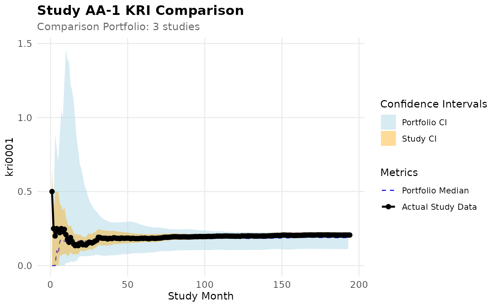
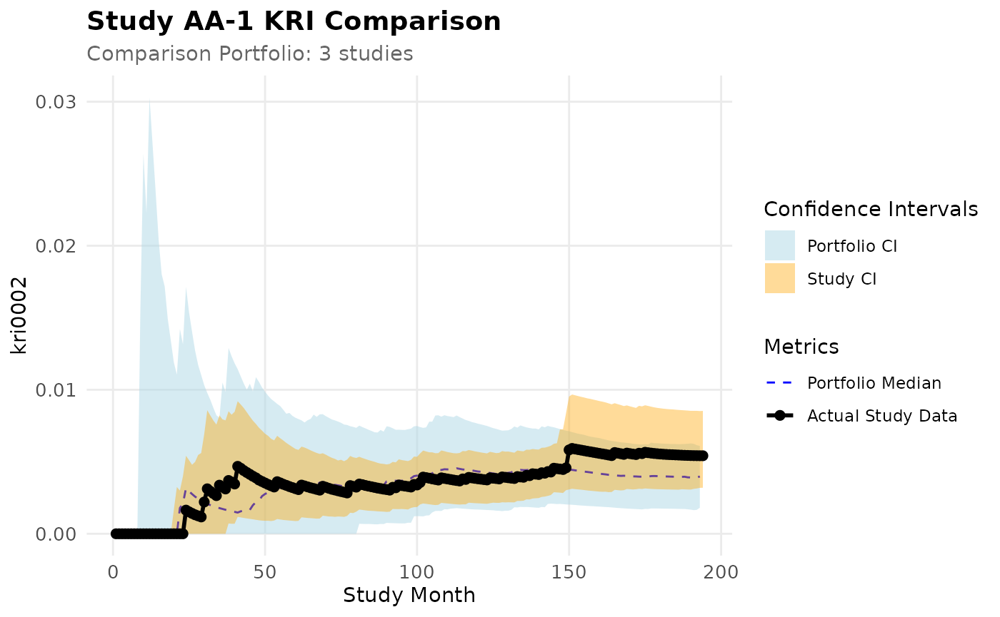
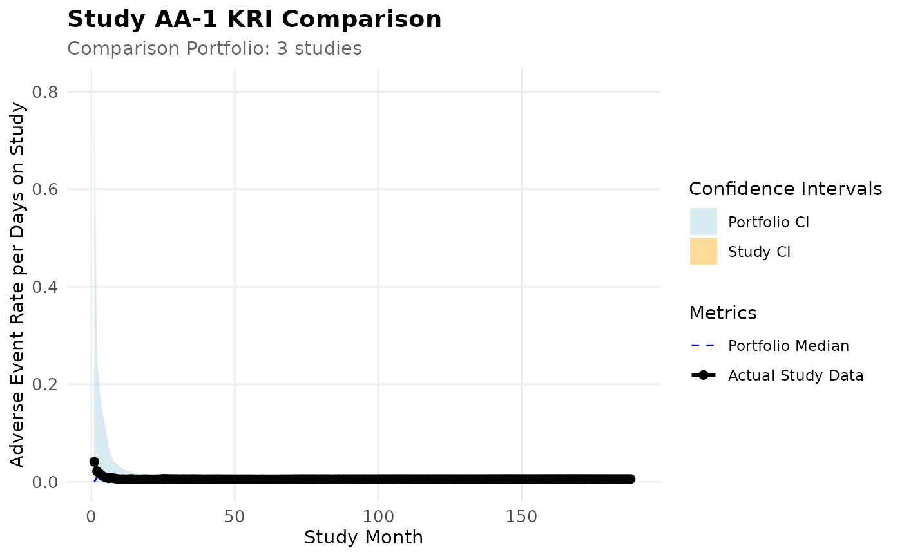

# In-Database Compatibility

## Installation

``` r
install.packages("pak")
pak::pak("Gilead-BioStats/clindata")
pak::pak("Gilead-BioStats/gsm.core")
pak::pak("Gilead-BioStats/gsm.mapping")
pak::pak("Gilead-BioStats/gsm.kri")
pak::pak("Gilead-BioStats/gsm.reporting")
pak::pak("IMPALA-Consortium/gsm.simaerep")
```

## Load

``` r
suppressPackageStartupMessages(library(dplyr))
library(gsm.core)
library(gsm.mapping)
library(gsm.kri)
library(gsm.reporting)
library(gsm.studykri)
#> 
#> Attaching package: 'gsm.studykri'
#> The following object is masked from 'package:gsm.reporting':
#> 
#>     BindResults
```

## Introduction

{gsm.studykir} functions can be executed on a database back-end instead
of relying on in-memory calculations.

The package supports various database backends including DuckDB,
PostgreSQL, and Snowflake. For backends that use large integer values
for random number generation (such as Snowflake), use the
`vDbIntRandomRange` parameter in bootstrap functions to ensure proper
normalization of random values.

## Database Backend Compatibility

### Random Number Generation

Most SQL databases translate R’s
[`runif()`](https://rdrr.io/r/stats/Uniform.html) to a `RANDOM()`
function that returns decimal values between 0 and 1. However, some
databases (notably Snowflake) return large integers instead. For these
backends, you must specify the integer range using the
`vDbIntRandomRange` parameter.

**Common Random Number Ranges:**

- **Snowflake** (signed 64-bit):
  `c(-9223372036854775808, 9223372036854775807)` (range: −2^63 to
  2^63−1)
- **Standard databases** (DuckDB, PostgreSQL, etc.): `NULL` (default,
  returns 0-1 decimals)

When `vDbIntRandomRange` is specified, the package automatically
normalizes the integer values to the 0-1 range using the formula:

``` r
normalized_value = (random_value - min_value) / (max_value - min_value)
```

**How to determine your database’s random range:**

If you’re unsure whether your database backend needs normalization, run
this query:

``` sql
SELECT RANDOM() FROM your_table LIMIT 10;
```

If the values are between 0 and 1, use the default
(`vDbIntRandomRange = NULL`). If they’re large integers, specify the
appropriate range.

## Simulate Data Set and Save to DuckDb

We use the clindata package which includes data from one clinical study
to simulate new study data. We create a portfolio with study AA-4
oversampling patients with low AE counts.

``` r
lRaw <- list(
  Raw_SITE = clindata::ctms_site,
  Raw_STUDY = clindata::ctms_study,
  Raw_PD = clindata::ctms_protdev,
  Raw_DATAENT = clindata::edc_data_pages,
  Raw_DATACHG = clindata::edc_data_points,
  Raw_QUERY = clindata::edc_queries,
  Raw_AE = clindata::rawplus_ae,
  Raw_SUBJ = clindata::rawplus_dm,
  Raw_ENROLL = clindata::rawplus_enroll,
  Raw_Randomization = clindata::rawplus_ixrsrand,
  Raw_LB = clindata::rawplus_lb,
  Raw_SDRGCOMP = clindata::rawplus_sdrgcomp,
  Raw_STUDCOMP = clindata::rawplus_studcomp,
  Raw_IE = clindata::rawplus_ie,
  Raw_VISIT = clindata::rawplus_visdt %>%
    mutate(visit_dt = lubridate::ymd(visit_dt))
)

# Add required subject identifier columns for resampling
lRaw$Raw_SUBJ$subjectname <- lRaw$Raw_SUBJ$subject_nsv
lRaw$Raw_SUBJ$subjectenrollmentnumber <- lRaw$Raw_SUBJ$subjid

lPortfolio <- SimulatePortfolio(
  lRaw = lRaw,
  nStudies = 4,
  vSubjectIDs = c("subjid", "subjectenrollmentnumber", "subject_nsv", "subjectname", "subjectid"),
  dfConfig = tibble(
    studyid = c("AA-1", "AA-2", "AA-3", "AA-4"),
    nSubjects = c(500, 750, 150, 200),
    strOversampleDomain = rep("Raw_AE", 4),
    vOversamplQuantileRange_min = c(0, 0, 0, 0),
    vOversamplQuantileRange_max = c(1, 1, 1, 0.75)
  )
)
#> Filtered to 1016 subjects with Raw_AE records in 0.00-1.00 quantile range (1-31 records)
#> Filtered to 1016 subjects with Raw_AE records in 0.00-1.00 quantile range (1-31 records)
#> Filtered to 1016 subjects with Raw_AE records in 0.00-1.00 quantile range (1-31 records)
#> Filtered to 773 subjects with Raw_AE records in 0.00-0.75 quantile range (1-6 records)

con <- DBI::dbConnect(duckdb::duckdb(), ":memory:")

purrr::walk2(names(lPortfolio), lPortfolio, ~ DBI::dbWriteTable(con, .x, .y))

dbPortfolio <- purrr::map(names(lPortfolio), ~ tbl(con, .x))
names(dbPortfolio) <- names(lPortfolio)
```

Here we create our data set.

``` r
tblInput1 <- gsm.studykri::Input_CountSiteByMonth(
  dfSubjects = dbPortfolio$Raw_SUBJ,
  dfNumerator = dbPortfolio$Raw_AE,
  dfDenominator = dbPortfolio$Raw_VISIT,
  strStudyCol = "studyid",
  strGroupCol = "invid",
  strGroupLevel = "Site",
  strSubjectCol = "subjid",
  strNumeratorDateCol = "aest_dt",
  strDenominatorDateCol = "visit_dt",
  strDenominatorType = "Visit"
)

tblInput2 <- gsm.studykri::Input_CountSiteByMonth(
  dfSubjects = dbPortfolio$Raw_SUBJ,
  dfNumerator = dbPortfolio$Raw_AE %>%
    filter(aeser == "Y"),
  dfDenominator = dbPortfolio$Raw_VISIT,
  strStudyCol = "studyid",
  strGroupCol = "invid",
  strGroupLevel = "Site",
  strSubjectCol = "subjid",
  strNumeratorDateCol = "aest_dt",
  strDenominatorDateCol = "visit_dt",
  strDenominatorType = "Visit"
)

tblInput <- dplyr::union_all(
  tblInput1 %>%
    mutate(MetricID = "kri0001"),
  tblInput2 %>%
    mutate(MetricID = "kri0002"),
)

# Load metric metadata from workflow files
metrics_wf <- gsm.core::MakeWorkflowList(
  strNames = c("kri0001.yaml", "kri0002.yaml"),
  strPath = system.file("workflow/2_metrics", package = "gsm.studykri"),
  strPackage = NULL
)

dfMetrics <- gsm.reporting::MakeMetric(metrics_wf)

lJoined <- JoinKRIByDenominator(tblInput, dfMetrics)

lJoined
#> $Visit
#> # Source:   SQL [?? x 7]
#> # Database: DuckDB 1.4.4 [unknown@Linux 6.14.0-1017-azure:R 4.5.2/:memory:]
#>    GroupID    GroupLevel Denominator StudyID MonthYYYYMM Numerator_kri0001
#>    <chr>      <chr>            <dbl> <chr>         <dbl>             <dbl>
#>  1 AA-1_0X041 Site                 1 AA-1         200907                 1
#>  2 AA-1_0X096 Site                 1 AA-1         200711                 1
#>  3 AA-1_0X051 Site                 1 AA-1         201201                 1
#>  4 AA-1_0X051 Site                 1 AA-1         201208                 1
#>  5 AA-1_0X052 Site                 3 AA-1         200807                 3
#>  6 AA-1_0X052 Site                 3 AA-1         200809                 1
#>  7 AA-1_0X052 Site                 3 AA-1         201001                 2
#>  8 AA-1_0X093 Site                 3 AA-1         201703                 1
#>  9 AA-1_0X093 Site                 6 AA-1         201506                 2
#> 10 AA-1_0X093 Site                 3 AA-1         201603                 1
#> # ℹ more rows
#> # ℹ 1 more variable: Numerator_kri0002 <dbl>
```

Next we prepare for the actual bootstrap simulation. For this we need to
perform multiple cross joins that require the creation of temporary
tables in the backend. {gsm.studykri} will attempt to create them using
the connection attached to the lazy tables. However if write priveleges
are not sufficient we can also create the tables manually and pass them
to the relevant functions.

``` r
dfStudyRef <- tibble(
  StudyID = "AA-1",
  StudyRef = c("AA-2", "AA-3", "AA-4")
)

dfRep <- tibble(
  BootstrapRep = seq(1, 1000)
)

dfMonths <- tibble(
  YYYY = seq(2003, 2020)
) %>%
  cross_join(
    tibble(
      MM = seq(1, 12)
    )
  ) %>%
  mutate(
    MonthYYYYMM = YYYY * 100 + MM
  ) %>%
  select(MonthYYYYMM)

DBI::dbWriteTable(con, "StudyRef", dfStudyRef, overwrite = TRUE)
DBI::dbWriteTable(con, "Rep", dfRep, overwrite = TRUE)
DBI::dbWriteTable(con, "Months", dfMonths, overwrite = TRUE)


tblStudyRef <- tbl(con, "StudyRef")
tblRep <- tbl(con, "Rep")
tblMonths <- tbl(con, "Months")


Bounds_Wide <- purrr::map(
  lJoined, ~ Analyze_StudyKRI_PredictBounds(
    .,
    dfStudyRef = tblStudyRef,
    tblBootstrapReps = tblRep,
    tblMonthSequence = tblMonths
  )
)

BoundsRef_Wide <- purrr::map(
  lJoined, ~ Analyze_StudyKRI_PredictBoundsRef(
    .,
    dfStudyRef = tblStudyRef,
    tblBootstrapReps = tblRep,
    tblMonthSequence = tblMonths
  )
)
#> Calculated minimum group count: 73

tblBounds <- Transform_Long(Bounds_Wide)

tblBoundsRef <- Transform_Long(BoundsRef_Wide)

tblTransformed <- union_all(
  tblInput1 %>%
    Transform_CumCount(vBy = "StudyID", tblMonthSequence = tblMonths) %>%
    mutate(MetricID = "kri0001"),
  tblInput2 %>%
    Transform_CumCount(vBy = "StudyID", tblMonthSequence = tblMonths) %>%
    mutate(MetricID = "kri0002"),
)


tblBounds
#> # Source:     SQL [?? x 8]
#> # Database:   DuckDB 1.4.4 [unknown@Linux 6.14.0-1017-azure:R 4.5.2/:memory:]
#> # Ordered by: StudyID, StudyMonth
#>    MetricID DenominatorType StudyID StudyMonth BootstrapCount Median Lower Upper
#>    <chr>    <chr>           <chr>        <dbl>          <int>  <dbl> <dbl> <dbl>
#>  1 kri0001  Visit           AA-1           124           1000  0.200 0.184 0.219
#>  2 kri0001  Visit           AA-1           125           1000  0.200 0.185 0.218
#>  3 kri0001  Visit           AA-1           128           1000  0.201 0.185 0.218
#>  4 kri0001  Visit           AA-1           129           1000  0.200 0.185 0.218
#>  5 kri0001  Visit           AA-1           130           1000  0.200 0.185 0.219
#>  6 kri0001  Visit           AA-1           131           1000  0.200 0.185 0.218
#>  7 kri0001  Visit           AA-1           137           1000  0.200 0.185 0.217
#>  8 kri0001  Visit           AA-1           139           1000  0.200 0.186 0.218
#>  9 kri0001  Visit           AA-1           145           1000  0.203 0.188 0.220
#> 10 kri0001  Visit           AA-1           150           1000  0.206 0.190 0.224
#> # ℹ more rows

tblBoundsRef
#> Warning: Missing values are always removed in SQL aggregation functions.
#> Use `na.rm = TRUE` to silence this warning
#> This warning is displayed once every 8 hours.
#> # Source:     SQL [?? x 11]
#> # Database:   DuckDB 1.4.4 [unknown@Linux 6.14.0-1017-azure:R 4.5.2/:memory:]
#> # Ordered by: StudyMonth
#>    MetricID DenominatorType StudyMonth BootstrapCount GroupCount StudyCount
#>    <chr>    <chr>                <dbl>          <int>      <dbl>      <int>
#>  1 kri0001  Visit                   66           1000         73          3
#>  2 kri0001  Visit                   77           1000         73          3
#>  3 kri0001  Visit                   78           1000         73          3
#>  4 kri0001  Visit                   80           1000         73          3
#>  5 kri0001  Visit                   84           1000         73          3
#>  6 kri0001  Visit                   86           1000         73          3
#>  7 kri0001  Visit                   87           1000         73          3
#>  8 kri0001  Visit                   90           1000         73          3
#>  9 kri0001  Visit                   95           1000         73          3
#> 10 kri0001  Visit                   99           1000         73          3
#> # ℹ more rows
#> # ℹ 5 more variables: StudyID <chr>, StudyRefID <chr>, Median <dbl>,
#> #   Lower <dbl>, Upper <dbl>

tblTransformed
#> # Source:     SQL [?? x 8]
#> # Database:   DuckDB 1.4.4 [unknown@Linux 6.14.0-1017-azure:R 4.5.2/:memory:]
#> # Ordered by: StudyID, StudyMonth
#>    StudyID MonthYYYYMM StudyMonth Numerator Denominator Metric GroupCount
#>    <chr>         <dbl>      <dbl>     <dbl>       <dbl>  <dbl>      <dbl>
#>  1 AA-4         200311          1         0           1 0               1
#>  2 AA-4         200312          2         0           2 0               1
#>  3 AA-4         200401          3         0           5 0               3
#>  4 AA-4         200402          4         0           8 0               3
#>  5 AA-4         200403          5         0          12 0               4
#>  6 AA-4         200404          6         2          19 0.105           6
#>  7 AA-4         200405          7         2          29 0.0690          7
#>  8 AA-4         200406          8         2          37 0.0541          8
#>  9 AA-4         200407          9         4          50 0.08            9
#> 10 AA-4         200408         10         5          66 0.0758         12
#> # ℹ more rows
#> # ℹ 1 more variable: MetricID <chr>
```

Finally before plotting we need to collect the results into memory.

``` r
metrics_wf <- gsm.core::MakeWorkflowList(
  strNames = NULL,
  strPath = system.file("workflow/2_metrics", package = "gsm.studykri"),
  strPackage = NULL
)

dfMetrics <- gsm.reporting::MakeMetric(metrics_wf)


lCharts <- gsm.studykri::MakeCharts_StudyKRI(
  dfResults = collect(tblTransformed),
  dfBounds = collect(tblBounds),
  dfBoundsRef = collect(tblBoundsRef),
  dfMetrics = dfMetrics
)

lCharts
#> $`AA-1_kri0001`
```



    #> 
    #> $`AA-1_kri0002`



## Using workflows

Unfortunately the data specfication checks from gsm.core will not work
on lazy tables. We therefore need to skip the mapping workflow and
ignore the warnings for the missing specifications.

We might also scrub some of the specifications from the yaml files to
begin with.

``` r
lMapped <- list(
  Mapped_AE = dbPortfolio$Raw_AE,
  Mapped_Visit = dbPortfolio$Raw_VISIT,
  Mapped_SUBJ = dbPortfolio$Raw_SUBJ %>%
    filter(enrollyn == "Y"),
  Mapped_StudyRef = tbl(con, "StudyRef")
)

metrics_wf <- gsm.core::MakeWorkflowList(
  strNames = "kri0001.yaml",
  strPath = system.file("workflow/2_metrics", package = "gsm.studykri"),
  strPackage = NULL
)

lAnalyzed <- gsm.core::RunWorkflows(lWorkflows = metrics_wf, lData = lMapped)
#> 
#> ── Running 1 Workflows ─────────────────────────────────────────────────────────
#> 
#> ── Initializing `Analysis_kri0001` Workflow ────────────────────────────────────
#> 
#> ── Checking data against spec
#> → All 2 data.frame(s) in the spec are present in the data: Mapped_AE, Mapped_SUBJ
#> Warning: Not all columns of Mapped_AE in the spec are in the expected format, improperly
#> formatted columns are: subjid
#> Not all columns of Mapped_AE in the spec are in the expected format, improperly
#> formatted columns are: aest_dt
#> Warning: Not all columns of Mapped_SUBJ in the spec are in the expected format,
#> improperly formatted columns are: subjid
#> Not all columns of Mapped_SUBJ in the spec are in the expected format,
#> improperly formatted columns are: invid
#> Not all columns of Mapped_SUBJ in the spec are in the expected format,
#> improperly formatted columns are: studyid
#> Not all columns of Mapped_SUBJ in the spec are in the expected format,
#> improperly formatted columns are: firstparticipantdate
#> Not all columns of Mapped_SUBJ in the spec are in the expected format,
#> improperly formatted columns are: lastparticipantdate
#> Warning: Not all specified columns in the spec are present in the data, missing columns
#> are: Mapped_AE$subjid
#> Not all specified columns in the spec are present in the data, missing columns
#> are: Mapped_AE$aest_dt
#> Not all specified columns in the spec are present in the data, missing columns
#> are: Mapped_SUBJ$subjid
#> Not all specified columns in the spec are present in the data, missing columns
#> are: Mapped_SUBJ$invid
#> Not all specified columns in the spec are present in the data, missing columns
#> are: Mapped_SUBJ$studyid
#> Not all specified columns in the spec are present in the data, missing columns
#> are: Mapped_SUBJ$firstparticipantdate
#> Not all specified columns in the spec are present in the data, missing columns
#> are: Mapped_SUBJ$lastparticipantdate
#> 
#> ── Workflow Step 1 of 3: `gsm.studykri::Input_CountSiteByMonth` ──
#> 
#> ── Evaluating 12 parameter(s) for `gsm.studykri::Input_CountSiteByMonth`
#> ✔ dfSubjects = Mapped_SUBJ: Passing lData$Mapped_SUBJ.
#> ✔ dfNumerator = Mapped_AE: Passing lData$Mapped_AE.
#> ✔ dfDenominator = Mapped_SUBJ: Passing lData$Mapped_SUBJ.
#> ℹ strStudyCol = studyid: No matching data found. Passing 'studyid' as a string.
#> ℹ strGroupCol = invid: No matching data found. Passing 'invid' as a string.
#> ✔ strGroupLevel = GroupLevel: Passing lMeta$GroupLevel.
#> ℹ strSubjectCol = subjid: No matching data found. Passing 'subjid' as a string.
#> ℹ strNumeratorDateCol = aest_dt: No matching data found. Passing 'aest_dt' as a string.
#> ℹ strDenominatorDateCol = firstparticipantdate: No matching data found. Passing 'firstparticipantdate' as a string.
#> ℹ strDenominatorEndDateCol = lastparticipantdate: No matching data found. Passing 'lastparticipantdate' as a string.
#> ✔ strDenominatorType = Denominator: Passing lMeta$Denominator.
#> ✔ nMinDenominator = AccrualThreshold: Passing lMeta$AccrualThreshold.
#> 
#> ── Calling `gsm.studykri::Input_CountSiteByMonth`
#> 
#> ── list of length 2 saved as `lData$Analysis_Input`.
#> 
#> ── Workflow Step 2 of 3: `gsm.studykri::Transform_CumCount` ──
#> 
#> ── Evaluating 2 parameter(s) for `gsm.studykri::Transform_CumCount`
#> ✔ dfInput = Analysis_Input: Passing lData$Analysis_Input.
#> ℹ vBy = StudyID: No matching data found. Passing 'StudyID' as a string.
#> 
#> ── Calling `gsm.studykri::Transform_CumCount`
#> 
#> ── list of length 2 saved as `lData$Analysis_Transformed`.
#> 
#> ── Workflow Step 3 of 3: `list` ──
#> 
#> ── Evaluating 3 parameter(s) for `list`
#> ✔ ID = ID: Passing lMeta$ID.
#> ✔ Analysis_Input = Analysis_Input: Passing lData$Analysis_Input.
#> ✔ Analysis_Transformed = Analysis_Transformed: Passing lData$Analysis_Transformed.
#> 
#> ── Calling `list`
#> 
#> ── list of length 3 saved as `lData$lAnalysis`.
#> 
#> ── Returning results from final step: list of length 3`. ──
#> 
#> ── Completed `Analysis_kri0001` Workflow ───────────────────────────────────────

reporting_wf <- gsm.core::MakeWorkflowList(
  strNames = c("Bounds", "BoundsRef", "Input", "Join", "Metrics", "Results"),
  strPath = system.file("workflow/3_reporting", package = "gsm.studykri")
)

lReporting <- gsm.core::RunWorkflows(
  lWorkflows = reporting_wf,
  lData = c(
    lMapped,
    list(
      lAnalyzed = lAnalyzed,
      lWorkflows = metrics_wf
    )
  )
)
#> 
#> ── Running 6 Workflows ─────────────────────────────────────────────────────────
#> 
#> ── Initializing `Reporting_Results` Workflow ───────────────────────────────────
#> 
#> ── No spec found in workflow. Proceeding without checking data.
#> 
#> ── Workflow Step 1 of 1: `gsm.studykri::BindResults` ──
#> 
#> ── Evaluating 2 parameter(s) for `gsm.studykri::BindResults`
#> ✔ lAnalysis = lAnalyzed: Passing lData$lAnalyzed.
#> ℹ strName = Analysis_Transformed: No matching data found. Passing 'Analysis_Transformed' as a string.
#> 
#> ── Calling `gsm.studykri::BindResults`
#> 
#> ── list of length 2 saved as `lData$lResults`.
#> 
#> ── Returning results from final step: list of length 2`. ──
#> 
#> ── Completed `Reporting_Results` Workflow ──────────────────────────────────────
#> 
#> ── Initializing `Reporting_Input` Workflow ─────────────────────────────────────
#> 
#> ── No spec found in workflow. Proceeding without checking data.
#> 
#> ── Workflow Step 1 of 1: `gsm.studykri::BindResults` ──
#> 
#> ── Evaluating 2 parameter(s) for `gsm.studykri::BindResults`
#> ✔ lAnalysis = lAnalyzed: Passing lData$lAnalyzed.
#> ℹ strName = Analysis_Input: No matching data found. Passing 'Analysis_Input' as a string.
#> 
#> ── Calling `gsm.studykri::BindResults`
#> 
#> ── list of length 2 saved as `lData$Reporting_Input`.
#> 
#> ── Returning results from final step: list of length 2`. ──
#> 
#> ── Completed `Reporting_Input` Workflow ────────────────────────────────────────
#> 
#> ── Initializing `Reporting_Metrics` Workflow ───────────────────────────────────
#> 
#> ── No spec found in workflow. Proceeding without checking data.
#> 
#> ── Workflow Step 1 of 1: `gsm.reporting::MakeMetric` ──
#> 
#> ── Evaluating 1 parameter(s) for `gsm.reporting::MakeMetric`
#> ✔ lWorkflows = lWorkflows: Passing lData$lWorkflows.
#> 
#> ── Calling `gsm.reporting::MakeMetric`
#> 
#> ── 1x16 data.frame saved as `lData$Reporting_Metrics`.
#> 
#> ── Returning results from final step: 1x16 data.frame`. ──
#> 
#> ── Completed `Reporting_Metrics` Workflow ──────────────────────────────────────
#> 
#> ── Initializing `Reporting_Join` Workflow ──────────────────────────────────────
#> 
#> ── Checking data against spec
#> → All 2 data.frame(s) in the spec are present in the data: Reporting_Input, Reporting_Metrics
#> Warning: Not all columns of Reporting_Input in the spec are in the expected format,
#> improperly formatted columns are: MetricID
#> Not all columns of Reporting_Input in the spec are in the expected format,
#> improperly formatted columns are: GroupID
#> Not all columns of Reporting_Input in the spec are in the expected format,
#> improperly formatted columns are: GroupLevel
#> Not all columns of Reporting_Input in the spec are in the expected format,
#> improperly formatted columns are: Numerator
#> Not all columns of Reporting_Input in the spec are in the expected format,
#> improperly formatted columns are: Denominator
#> Not all columns of Reporting_Input in the spec are in the expected format,
#> improperly formatted columns are: StudyID
#> Not all columns of Reporting_Input in the spec are in the expected format,
#> improperly formatted columns are: MonthYYYYMM
#> Warning: Not all specified columns in the spec are present in the data, missing columns
#> are: Reporting_Input$MetricID
#> Not all specified columns in the spec are present in the data, missing columns
#> are: Reporting_Input$GroupID
#> Not all specified columns in the spec are present in the data, missing columns
#> are: Reporting_Input$GroupLevel
#> Not all specified columns in the spec are present in the data, missing columns
#> are: Reporting_Input$Numerator
#> Not all specified columns in the spec are present in the data, missing columns
#> are: Reporting_Input$Denominator
#> Not all specified columns in the spec are present in the data, missing columns
#> are: Reporting_Input$StudyID
#> Not all specified columns in the spec are present in the data, missing columns
#> are: Reporting_Input$MonthYYYYMM
#> 
#> ── Workflow Step 1 of 1: `gsm.studykri::JoinKRIByDenominator` ──
#> 
#> ── Evaluating 2 parameter(s) for `gsm.studykri::JoinKRIByDenominator`
#> ✔ dfInput = Reporting_Input: Passing lData$Reporting_Input.
#> ✔ dfMetrics = Reporting_Metrics: Passing lData$Reporting_Metrics.
#> 
#> ── Calling `gsm.studykri::JoinKRIByDenominator`
#> 
#> ── list of length 1 saved as `lData$Joined_Analysis_Input`.
#> 
#> ── Returning results from final step: list of length 1`. ──
#> 
#> ── Completed `Reporting_Join` Workflow ─────────────────────────────────────────
#> 
#> ── Initializing `Reporting_Bounds` Workflow ────────────────────────────────────
#> 
#> ── Checking data against spec
#> → All 2 data.frame(s) in the spec are present in the data: Reporting_Join, Mapped_StudyRef
#> → All specified columns in Mapped_StudyRef are in the expected format
#> Warning: Not all specified columns in the spec are present in the data, missing columns
#> are: Mapped_StudyRef$study
#> Not all specified columns in the spec are present in the data, missing columns
#> are: Mapped_StudyRef$studyref
#> 
#> ── Workflow Step 1 of 3: `gsm.studykri::ParseFunction` ──
#> 
#> ── Evaluating 1 parameter(s) for `gsm.studykri::ParseFunction`
#> ℹ strFunction = gsm.studykri::Analyze_StudyKRI_PredictBounds: No matching data found. Passing 'gsm.studykri::Analyze_StudyKRI_PredictBounds' as a string.
#> 
#> ── Calling `gsm.studykri::ParseFunction`
#> 
#> ── closure of length 1 saved as `lData$PredictBounds_Func`.
#> 
#> ── Workflow Step 2 of 3: `purrr::map` ──
#> 
#> ── Evaluating 5 parameter(s) for `purrr::map`
#> ✔ .x = Reporting_Join: Passing lData$Reporting_Join.
#> ✔ .f = PredictBounds_Func: Passing lData$PredictBounds_Func.
#> ✔ dfStudyRef = Mapped_StudyRef: Passing lData$Mapped_StudyRef.
#> ✔ nBootstrapReps = BootstrapReps: Passing lMeta$BootstrapReps.
#> ✔ nConfLevel = Threshold: Passing lMeta$Threshold.
#> 
#> ── Calling `purrr::map`
#> 
#> ── list of length 1 saved as `lData$Analysis_Bounds_Wide`.
#> 
#> ── Workflow Step 3 of 3: `gsm.studykri::Transform_Long` ──
#> 
#> ── Evaluating 1 parameter(s) for `gsm.studykri::Transform_Long`
#> ✔ lWide = Analysis_Bounds_Wide: Passing lData$Analysis_Bounds_Wide.
#> 
#> ── Calling `gsm.studykri::Transform_Long`
#> 
#> ── list of length 2 saved as `lData$Reporting_Bounds`.
#> 
#> ── Returning results from final step: list of length 2`. ──
#> 
#> ── Completed `Reporting_Bounds` Workflow ───────────────────────────────────────
#> 
#> ── Initializing `Reporting_BoundsRef` Workflow ─────────────────────────────────
#> 
#> ── Checking data against spec
#> → All 2 data.frame(s) in the spec are present in the data: Reporting_Join, Mapped_StudyRef
#> → All specified columns in Mapped_StudyRef are in the expected format
#> Warning: Not all specified columns in the spec are present in the data, missing columns
#> are: Mapped_StudyRef$study
#> Not all specified columns in the spec are present in the data, missing columns
#> are: Mapped_StudyRef$studyref
#> 
#> ── Workflow Step 1 of 3: `gsm.studykri::ParseFunction` ──
#> 
#> ── Evaluating 1 parameter(s) for `gsm.studykri::ParseFunction`
#> ℹ strFunction = gsm.studykri::Analyze_StudyKRI_PredictBoundsRef: No matching data found. Passing 'gsm.studykri::Analyze_StudyKRI_PredictBoundsRef' as a string.
#> 
#> ── Calling `gsm.studykri::ParseFunction`
#> 
#> ── closure of length 1 saved as `lData$PredictBoundsRef_Func`.
#> 
#> ── Workflow Step 2 of 3: `purrr::map` ──
#> 
#> ── Evaluating 6 parameter(s) for `purrr::map`
#> ✔ .x = Reporting_Join: Passing lData$Reporting_Join.
#> ✔ .f = PredictBoundsRef_Func: Passing lData$PredictBoundsRef_Func.
#> ✔ dfStudyRef = Mapped_StudyRef: Passing lData$Mapped_StudyRef.
#> ✔ nBootstrapReps = BootstrapReps: Passing lMeta$BootstrapReps.
#> ✔ nConfLevel = Threshold: Passing lMeta$Threshold.
#> ✔ bMixStudies = bMixStudies: Passing lMeta$bMixStudies.
#> 
#> ── Calling `purrr::map`
#> Calculated minimum group count: 73
#> 
#> ── list of length 1 saved as `lData$Analysis_BoundsRef_Wide`.
#> 
#> ── Workflow Step 3 of 3: `gsm.studykri::Transform_Long` ──
#> 
#> ── Evaluating 1 parameter(s) for `gsm.studykri::Transform_Long`
#> ✔ lWide = Analysis_BoundsRef_Wide: Passing lData$Analysis_BoundsRef_Wide.
#> 
#> ── Calling `gsm.studykri::Transform_Long`
#> 
#> ── list of length 2 saved as `lData$Reporting_BoundsRef`.
#> 
#> ── Returning results from final step: list of length 2`. ──
#> 
#> ── Completed `Reporting_BoundsRef` Workflow ────────────────────────────────────

lReporting
#> $Reporting_Results
#> # Source:     SQL [?? x 9]
#> # Database:   DuckDB 1.4.4 [unknown@Linux 6.14.0-1017-azure:R 4.5.2/:memory:]
#> # Ordered by: StudyID, StudyMonth
#>    StudyID MonthYYYYMM StudyMonth Numerator Denominator Metric GroupCount
#>    <chr>         <dbl>      <dbl>     <dbl>       <dbl>  <dbl>      <dbl>
#>  1 AA-3         200410          1        22          65 0.338           5
#>  2 AA-3         200411          2        22         209 0.105           5
#>  3 AA-3         200412          3        25         333 0.0751          4
#>  4 AA-3         200501          4        26         457 0.0569          4
#>  5 AA-3         200502          5        26         581 0.0448          7
#>  6 AA-3         200503          6        27         873 0.0309         10
#>  7 AA-3         200504          7        32        1259 0.0254         13
#>  8 AA-3         200505          8        35        1693 0.0207         13
#>  9 AA-3         200506          9        39        2113 0.0185         13
#> 10 AA-3         200507         10        41        2559 0.0160         14
#> # ℹ more rows
#> # ℹ 2 more variables: MetricID <chr>, SnapshotDate <date>
#> 
#> $Reporting_Input
#> # Source:   SQL [?? x 10]
#> # Database: DuckDB 1.4.4 [unknown@Linux 6.14.0-1017-azure:R 4.5.2/:memory:]
#>    GroupID    GroupLevel Numerator Denominator Metric StudyID MonthYYYYMM
#>    <chr>      <chr>          <dbl>       <dbl>  <dbl> <chr>         <dbl>
#>  1 AA-1_0X018 Site               1          31 0.0323 AA-1         201203
#>  2 AA-1_0X035 Site               1          31 0.0323 AA-1         200407
#>  3 AA-1_0X035 Site               1          30 0.0333 AA-1         200404
#>  4 AA-1_0X035 Site               1          31 0.0323 AA-1         200512
#>  5 AA-1_0X035 Site               1          31 0.0323 AA-1         200408
#>  6 AA-1_0X162 Site               1          62 0.0161 AA-1         201612
#>  7 AA-1_0X162 Site               1          62 0.0161 AA-1         201705
#>  8 AA-1_0X069 Site               1          30 0.0333 AA-1         200704
#>  9 AA-1_0X069 Site               1          31 0.0323 AA-1         200603
#> 10 AA-1_0X023 Site               1          31 0.0323 AA-1         201010
#> # ℹ more rows
#> # ℹ 3 more variables: DenominatorType <chr>, MetricID <chr>,
#> #   SnapshotDate <date>
#> 
#> $Reporting_Metrics
#> # A tibble: 1 × 16
#>   Type    ID    GroupLevel Abbreviation Metric Numerator Denominator Model Score
#>   <chr>   <chr> <chr>      <chr>        <chr>  <chr>     <chr>       <chr> <chr>
#> 1 Analys… kri0… Site       AE           Adver… Adverse … Days on St… Boot… Boot…
#> # ℹ 7 more variables: AnalysisType <chr>, Threshold <dbl>,
#> #   AccrualThreshold <int>, AccrualMetric <chr>, BootstrapReps <int>,
#> #   Priority <dbl>, MetricID <chr>
#> 
#> $Reporting_Join
#> $Reporting_Join$`Days on Study`
#> # Source:   SQL [?? x 6]
#> # Database: DuckDB 1.4.4 [unknown@Linux 6.14.0-1017-azure:R 4.5.2/:memory:]
#>    GroupID    GroupLevel Denominator StudyID MonthYYYYMM Numerator_Analysis_kr…¹
#>    <chr>      <chr>            <dbl> <chr>         <dbl>                   <dbl>
#>  1 AA-1_0X162 Site                31 AA-1         201805                       1
#>  2 AA-1_0X069 Site                30 AA-1         200606                       3
#>  3 AA-1_0X069 Site                31 AA-1         200601                       2
#>  4 AA-1_0X161 Site                30 AA-1         201106                       1
#>  5 AA-1_0X153 Site                30 AA-1         201611                       1
#>  6 AA-1_0X093 Site                31 AA-1         201210                       2
#>  7 AA-1_0X016 Site                24 AA-1         201906                       1
#>  8 AA-1_0X051 Site                31 AA-1         201208                       1
#>  9 AA-1_0X102 Site                60 AA-1         201411                       1
#> 10 AA-1_0X093 Site               124 AA-1         201703                       1
#> # ℹ more rows
#> # ℹ abbreviated name: ¹​Numerator_Analysis_kri0001
#> 
#> 
#> $Reporting_Bounds
#> # Source:     SQL [?? x 8]
#> # Database:   DuckDB 1.4.4 [unknown@Linux 6.14.0-1017-azure:R 4.5.2/:memory:]
#> # Ordered by: StudyID, StudyMonth
#>    MetricID    DenominatorType StudyID StudyMonth BootstrapCount  Median   Lower
#>    <chr>       <chr>           <chr>        <dbl>          <int>   <dbl>   <dbl>
#>  1 Analysis_k… Days on Study   AA-1             2           1000 0.0209  0.00679
#>  2 Analysis_k… Days on Study   AA-1            10           1000 0.00532 0.00289
#>  3 Analysis_k… Days on Study   AA-1            18           1000 0.00542 0.00400
#>  4 Analysis_k… Days on Study   AA-1            28           1000 0.00585 0.00458
#>  5 Analysis_k… Days on Study   AA-1            29           1000 0.00583 0.00451
#>  6 Analysis_k… Days on Study   AA-1            34           1000 0.00569 0.00446
#>  7 Analysis_k… Days on Study   AA-1            39           1000 0.00559 0.00442
#>  8 Analysis_k… Days on Study   AA-1            42           1000 0.00567 0.00461
#>  9 Analysis_k… Days on Study   AA-1            47           1000 0.00563 0.00469
#> 10 Analysis_k… Days on Study   AA-1            49           1000 0.00553 0.00463
#> # ℹ more rows
#> # ℹ 1 more variable: Upper <dbl>
#> 
#> $Reporting_BoundsRef
#> # Source:     SQL [?? x 11]
#> # Database:   DuckDB 1.4.4 [unknown@Linux 6.14.0-1017-azure:R 4.5.2/:memory:]
#> # Ordered by: StudyMonth
#>    MetricID      DenominatorType StudyMonth BootstrapCount GroupCount StudyCount
#>    <chr>         <chr>                <dbl>          <int>      <dbl>      <int>
#>  1 Analysis_kri… Days on Study           57           1000         73          3
#>  2 Analysis_kri… Days on Study           59           1000         73          3
#>  3 Analysis_kri… Days on Study           61           1000         73          3
#>  4 Analysis_kri… Days on Study           66           1000         73          3
#>  5 Analysis_kri… Days on Study           77           1000         73          3
#>  6 Analysis_kri… Days on Study           78           1000         73          3
#>  7 Analysis_kri… Days on Study           80           1000         73          3
#>  8 Analysis_kri… Days on Study           84           1000         73          3
#>  9 Analysis_kri… Days on Study           86           1000         73          3
#> 10 Analysis_kri… Days on Study           87           1000         73          3
#> # ℹ more rows
#> # ℹ 5 more variables: StudyID <chr>, StudyRefID <chr>, Median <dbl>,
#> #   Lower <dbl>, Upper <dbl>
```

Next we collect the data and create the charts.

``` r
lCharts <- gsm.studykri::MakeCharts_StudyKRI(
  dfResults = collect(lReporting$Reporting_Results),
  dfBounds = collect(lReporting$Reporting_Bounds),
  dfBoundsRef = collect(lReporting$Reporting_BoundsRef),
  dfMetrics = lReporting$Reporting_Metrics
)

lCharts
#> $`AA-1_Analysis_kri0001`
```



## Using Snowflake or Other Integer Random Backends

If you’re using Snowflake or another database that returns large
integers for `RANDOM()`, add the `vDbIntRandomRange` parameter to your
bootstrap function calls:

``` r
# For Snowflake: specify signed 64-bit integer range
Bounds_Wide_Snowflake <- purrr::map(
  lJoined, ~ Analyze_StudyKRI_PredictBounds(
    .,
    dfStudyRef = tblStudyRef,
    tblBootstrapReps = tblRep,
    tblMonthSequence = tblMonths,
    vDbIntRandomRange = c(-9223372036854775808, 9223372036854775807)
  )
)

BoundsRef_Wide_Snowflake <- purrr::map(
  lJoined, ~ Analyze_StudyKRI_PredictBoundsRef(
    .,
    dfStudyRef = tblStudyRef,
    tblBootstrapReps = tblRep,
    tblMonthSequence = tblMonths,
    vDbIntRandomRange = c(-9223372036854775808, 9223372036854775807)
  )
)
```

The `vDbIntRandomRange` parameter should be added to:

- [`Analyze_StudyKRI_PredictBounds()`](https://impala-consortium.github.io/gsm.studykri/reference/Analyze_StudyKRI_PredictBounds.md)
- [`Analyze_StudyKRI_PredictBoundsRef()`](https://impala-consortium.github.io/gsm.studykri/reference/Analyze_StudyKRI_PredictBoundsRef.md)
- [`Analyze_StudyKRI_PredictBoundsRefSet()`](https://impala-consortium.github.io/gsm.studykri/reference/Analyze_StudyKRI_PredictBoundsRefSet.md)

This ensures that random values are properly normalized regardless of
the database backend’s random number generation method.

## Performance Optimization for Database Backends

### Optimization Strategy 1: Pass nMinGroups via StudyRef

The most impactful optimization is avoiding the collection of the full
dataset to calculate minimum group counts. By pre-calculating and
including a MinGroups column in your StudyRef table, you can avoid
materializing potentially millions of rows.

**How to calculate MinGroups:**

For each target study in your StudyRef mapping, calculate the minimum
group count across all its reference studies:

``` sql
-- Example: Calculate MinGroups for each target-reference set
WITH GroupCounts AS (
  SELECT 
    StudyID,
    COUNT(DISTINCT GroupID) AS group_count
  FROM Analysis_Input
  WHERE StudyID IN ('REF_STUDY_1', 'REF_STUDY_2', 'REF_STUDY_3')
  GROUP BY StudyID
)
SELECT 
  'TARGET_STUDY' AS studyid,
  'REF_STUDY_1' AS studyrefid,  -- repeat for each reference
  MIN(group_count) AS MinGroups
FROM GroupCounts;
```

**Then include it in your StudyRef table:**

The StudyRef.yaml workflow selects only the required `studyid` and
`studyrefid` columns. To use the MinGroups optimization, you have two
options:

**Option 1: Add MinGroups directly to your StudyRef data**

``` r
# Create Raw_StudyRef with MinGroups column
dfStudyRef <- tibble(
  studyid = "AA-1",
  studyrefid = c("AA-2", "AA-3", "AA-4"),
  MinGroups = 8 # Pre-calculated minimum across reference studies
)

# Write to database
DBI::dbWriteTable(con, "StudyRef", dfStudyRef, overwrite = TRUE)
tblStudyRef <- tbl(con, "StudyRef")

# Use in analysis - MinGroups will be automatically detected and used
BoundsRef_Optimized <- Analyze_StudyKRI_PredictBoundsRef(
  dfInput = tblInput,
  dfStudyRef = tblStudyRef,
  tblBootstrapReps = tblRep,
  tblMonthSequence = tblMonths
)
```

**Option 2: Use a custom mapping query**

If you need to transform the column name, create a custom StudyRef.yaml
workflow:

``` yaml
steps:
  - output: Mapped_StudyRef
    name: gsm.core::RunQuery
    params:
      df: Raw_StudyRef
      strQuery: "SELECT studyid AS study, studyrefid AS studyref, mingroups AS MinGroups FROM df"
```

**Option 3: Use a custom column name**

``` r
dfStudyRef_Custom <- tibble(
  studyid = "AA-1",
  studyrefid = c("AA-2", "AA-3", "AA-4"),
  min_grp_cnt = 8
)

BoundsRef_Custom <- Analyze_StudyKRI_PredictBoundsRef(
  dfInput = tblInput,
  dfStudyRef = tblStudyRef_Custom,
  strMinGroupsCol = "min_grp_cnt", # Specify custom column name
  tblBootstrapReps = tblRep,
  tblMonthSequence = tblMonths
)
```

### Optimization Strategy 2: Skip Validation Checks

The
[`JoinKRIByDenominator()`](https://impala-consortium.github.io/gsm.studykri/reference/JoinKRIByDenominator.md)
function performs several validation checks that require
[`collect()`](https://dplyr.tidyverse.org/reference/compute.html)
operations. When confident in data quality, skip these:

``` r
lJoined <- JoinKRIByDenominator(
  tblInput,
  dfMetrics,
  bSkipValidation = TRUE # Disable validation collect() operations
)
```

### Optimization Strategy 3: Pre-generate Temporary Tables

Provide pre-generated bootstrap replicates and month sequences to avoid
repeated temp table creation:

``` r
# Create once, reuse many times
dfRep <- tibble(BootstrapRep = seq(1, 1000))
dfMonths <- tibble(
  YYYY = seq(2003, 2020)
) %>%
  cross_join(tibble(MM = seq(1, 12))) %>%
  mutate(MonthYYYYMM = YYYY * 100 + MM) %>%
  select(MonthYYYYMM)

DBI::dbWriteTable(con, "Rep", dfRep)
DBI::dbWriteTable(con, "Months", dfMonths)

tblRep <- tbl(con, "Rep")
tblMonths <- tbl(con, "Months")

# Pass to all functions
Bounds <- Analyze_StudyKRI_PredictBounds(
  dfInput,
  tblBootstrapReps = tblRep,
  tblMonthSequence = tblMonths
)
```

### Optimization Strategy 4: Use funCompute to Cache Intermediate Results

When working with large database queries, you can use the `funCompute`
parameter to cache intermediate results in the database. This can
significantly improve performance by materializing temporary tables
rather than re-executing complex queries.

The `funCompute` parameter accepts a function that will be applied to
intermediate database results. The most common use case is
[`dplyr::compute()`](https://dplyr.tidyverse.org/reference/compute.html):

``` r
# Cache intermediate results during bootstrap calculations
BoundsRef_Cached <- Analyze_StudyKRI_PredictBoundsRef(
  dfInput = tblInput,
  dfStudyRef = tblStudyRef,
  nBootstrapReps = 1000,
  tblBootstrapReps = tblRep,
  tblMonthSequence = tblMonths,
  funCompute = dplyr::compute # Cache intermediate results
)
```

You can also provide a custom function for more control:

``` r
# Custom compute function - let dplyr auto-generate unique names
# (Important: don't specify fixed names as funCompute may be called multiple times)
custom_cache <- function(x) {
  dplyr::compute(x, temporary = TRUE)
}

BoundsRef_Custom <- Analyze_StudyKRI_PredictBoundsRef(
  dfInput = tblInput,
  dfStudyRef = tblStudyRef,
  nBootstrapReps = 1000,
  funCompute = custom_cache
)
```

**When to use `funCompute`:**

- Complex queries that are re-used multiple times
- Very large datasets where materialization is faster than
  re-computation
- When database query optimizer struggles with complex lazy query plans

**Performance trade-offs:**

- **Benefit**: Avoids re-executing expensive queries; can reduce query
  complexity
- **Cost**: Requires database write permissions; creates temporary
  tables that use storage

**Note**: `funCompute` is primarily beneficial for large datasets
(millions of rows), complex multi-study portfolios, or queries that are
re-executed multiple times. For small datasets or simple queries, the
overhead of creating temporary tables may outweigh benefits.

### Best Practices Summary

1.  **Add MinGroups column to StudyRef** (or use `strMinGroupsCol`
    parameter for custom names) for the biggest performance gain
2.  **Use `bSkipValidation = TRUE`** in
    [`JoinKRIByDenominator()`](https://impala-consortium.github.io/gsm.studykri/reference/JoinKRIByDenominator.md)
    when data quality is assured
3.  **Pre-generate temp tables** (`tblBootstrapReps`,
    `tblMonthSequence`) to avoid repeated creation
4.  **Use `funCompute`** to cache intermediate results when working with
    large datasets or complex queries
